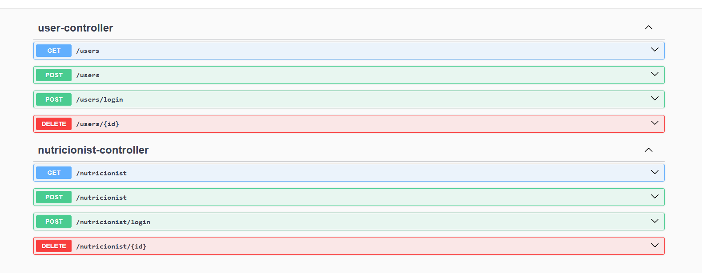
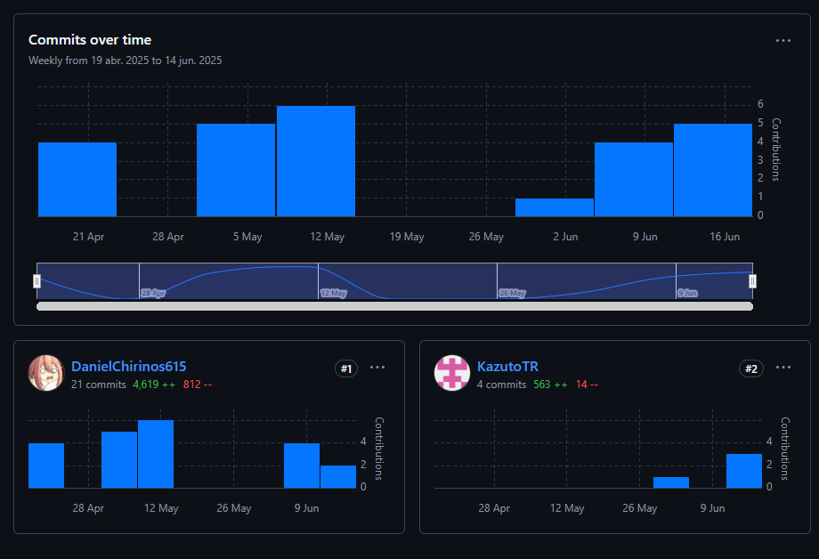

<h3 align="center"> Universidad Peruana de Ciencias Aplicadas </h3>

<h3 align="center"> Ingeniería de Software </h3>
<h3 align="center"> Ciclo 2025 - 10 </h3>

<br>

<div align="center">
  
</div>

<br>

<h1 align="center"> TB1 Report </h1>

<h3 align="center"> Diseño de Experimentos de Ingeniería de Software - 4436 </h3>

<h3 align="center"> Docente: </h3>

<h3 align="center"> Julio Manuel Noriega Melendez </h3>

<h3 align="center"> Startup: </h3>
<h3 align="center"> HealthySoft </h3>
<h3 align="center"> Product: </h3>
<h3 align="center"> NutriSmart </h3>

<h3 align="center"> Team Members: </h3>

<div align="center">

| Member                           |    Code    |
| :------------------------------- | :--------: |
| Aliaga Pimentel, George Arturo   | U20211c273 |
| Chirinos Arevalo, Daniel Rodrigo | U202019577 |
| Pingus Rodriguez, Carlos Daniel  | u202113280 |
| Linares Arroyo, Jorge Alexandro  | u202318624 |

</div>

<h3 align="center">Abril, 2025</h3>

<br><br>

# Registro de Versiones del Informe

<div align="center">

| Versión |   Fecha    |              Autor               | Descripción de modificación |
| :-----: | :--------: | :------------------------------: | :--------------------------: |
|   TB1   |    24/04   | George Aliaga, Daniel Chirinos, Carlos Pingus y Jorge Linares | Se estableció la solución propuesta, se realizó un análisis Lean UX, se definió el segmento objetivo y se recopilaron los requisitos necesarios para desarrollar las herramientas necesarias. A su vez, se implementó el landing page y un avance del backend. | 
| TP     | 12/05 | George Aliaga, Daniel Chirinos, Carlos Pingus y Jorge Linares | Se realizaron los avances de la aplicación en base a la retroalimentación de la primera entrega |

</div>

<br><br>

# Project Report Collaboration Insights

<br>

# Contenido

## Tabla de Contenidos

### [Registro de versiones del informe](#registro-de-versiones-del-informe)

### [Project Report Collaboration Insights](#project-report-collaboration-insights)

### [Contenido](#contenido)

### [Student Outcome](#student-outcome-1)

### [Capítulo I: Introducción](#capc3adtulo-i-introduccic3b3n-1)

- [1.1. Startup Profile](#11-startup-profile)
  - [1.1.1. Descripción de la Startup](#111-description-de-la-startup)
  - [1.1.2. Perfiles de integrantes del equipo](#112-perfiles-de-integrantes-del-equipo)
- [1.2. Solution Profile](#12-solution-profile)
  - [1.2.1 Antecedentes y problemática](#121-antecedentes-y-problemática)
  - [1.2.2 Lean UX Process](#122-lean-ux-process)
    - [1.2.2.1. Lean UX Problem Statements](#1221-lean-ux-problem-statements)
    - [1.2.2.2. Lean UX Assumptions](#1222-lean-ux-assumptions)
    - [1.2.2.3. Lean UX Hypothesis Statements](#1223-lean-ux-hypothesis-statements)
    - [1.2.2.4. Lean UX Canvas](#1224-lean-ux-canvas)
- [1.3. Segmentos objetivo](#13-segmentos-objetivo)

### [Capítulo II: Requirements Elicitation & Analysis](#capc3adtulo-ii-requirements-elicitation--analysis-1)

- [2.1. Competidores](#21-competidores)
  - [2.1.1. Análisis competitivo](#211-análisis-competitivo)
  - [2.1.2. Estrategias y tácticas frente a competidores](#212-estrategias-y-tácticas-frente-a-competidores)
- [2.2. Entrevistas](#22-entrevistas)
  - [2.2.1. Diseño de entrevistas](#221-diseño-de-entrevistas)
  - [2.2.2. Registro de entrevistas](#222-registro-de-entrevistas)
  - [2.2.3. Análisis de entrevistas](#223-análisis-de-entrevistas)
- [2.3. Needfinding](#23-needfinding)
  - [2.3.1. User Personas](#231-user-personas)
  - [2.3.2. User Task Matrix](#232-user-task-matrix)
  - [2.3.3. User Journey Mapping](#233-user-journey-mapping)
  - [2.3.4. Empathy Mapping](#234-empathy-mapping)
  - [2.3.5. As-is Scenario Mapping](#235-as-is-scenario-mapping)
- [2.4. Ubiquitous Language](#24-ubiquitous-language)

### [Capítulo III: Requirements Specification](#capc3adtulo-iii-requirements-specification-1)

- [3.1. To-Be Scenario Mapping](#31-to-be-scenario-mapping)
- [3.2. User Stories](#32-user-stories)
- [3.3. Impact Mapping](#33-impact-mapping)
- [3.4. Product Backlog](#34-product-backlog)

### [Capítulo IV: Product Design](#capc3adtulo-iv-product-design-1)

- [4.1. Style Guidelines](#41-style-guidelines)
  - [4.1.1. General Style Guidelines](#411-general-style-guidelines)
  - [4.1.2. Web Style Guidelines](#412-web-style-guidelines)
  - [4.1.3. Mobile Style Guidelines](#413-mobile-style-guidelines)
  - [4.1.3.1. IOS Mobile Style Guidelines](#412-ios-mobile-style-guidelines)
  - [4.1.3.2. Android Mobile Style Guidelines](#412-android-mobile-style-guidelines)
- [4.2. Information Architecture](#42-information-architecture)
  - [4.2.1. Organization Systems](#421-organization-systems)
  - [4.2.2. Labeling Systems](#422-labeling-systems)
  - [4.2.3. SEO Tags and Meta Tags](#423-seo-tags-and-meta-tags)
  - [4.2.4. Searching Systems](#424-searching-systems)
  - [4.2.5. Navigation Systems](#425-navigation-systems)
- [4.3. Landing Page UI Design](#43-landing-page-ui-design)
  - [4.3.1. Landing Page Wireframe](#431-landing-page-wireframe)
  - [4.3.2. Landing Page Mock-up](#432-landing-page-mock-up)
- [4.4. Mobile Applications UX/UI Design](#45-web-applications-prototyping)
  - [4.4.1. Mobile Applications Wireframes](#45-web-applications-prototyping)
  - [4.4.2. Mobile Applications Wireflow Diagrams](#45-web-applications-prototyping)
  - [4.4.3. Mobile Applications Mock-ups](#45-web-applications-prototyping)
  - [4.4.3. Mobile Applications User Flow Diagrams](#45-web-applications-prototyping)
- [4.5. Mobile Applications Prototyping](#45-web-applications-prototyping)
  - [4.5.1. Android Mobile Applications Prototyping](#45-web-applications-prototyping)
  - [4.5.2. iOS Mobile Applications Prototyping](#45-web-applications-prototyping)
- [4.6. Web Applications UX/UI Design](#44-web-applications-uxui-design)
  - [4.6.1. Web Applications Wireframes](#441-web-applications-wireframes)
  - [4.6.2. Web Applications Wireflow Diagrams](#442-web-applications-wireflow-diagrams)
  - [4.6.3. Web Applications Mock-ups](#443-web-applications-mock-ups)
  - [4.6.4. Web Applications User Flow Diagrams](#444-web-applications-user-flow-diagrams)
- [4.7. Web Applications Prototyping](#45-web-applications-prototyping)
- [4.8. Domain-Driven Software Architecture](#46-domain-driven-software-architecture)
  - [4.8.1. Software Architecture Context Diagram](#461-software-architecture-context-diagram)
  - [4.8.2. Software Architecture Container Diagrams](#462-software-architecture-container-diagrams)
  - [4.8.3. Software Architecture Components Diagrams](#463-software-architecture-components-diagrams)
- [4.9. Software Object-Oriented Design](#47-software-object-oriented-design)
  - [4.9.1. Class Diagrams](#471-class-diagrams)
  - [4.9.2. Class Dictionary](#472-class-dictionary)
- [4.10. Database Design](#48-database-design)
  - [4.10.1. Relational/Non-Relational Database Diagram](#481-database-diagram)

### [Capítulo V: Product Implementation, Validation & Deployment](#capc3adtulo-v-product-implementation-validation--deployment-1)
  - [5.1. Software Configuration Management](#51-software-configuration-management)
    - [5.1.1. Software Development Environment Configuration](#511-software-development-environment-configuration)
    - [5.1.2. Source Code Management](#512-source-code-management)
    - [5.1.3. Source Code Style Guide \& Conventions](#513-source-code-style-guide--conventions)
    - [5.1.4. Software Deployment Configuration](#514-software-deployment-configuration)
  - [5.2. Product Implementation & Deployment](#52-landing-page-services--applications-implementation)
    - [5.2.1. Sprint Backlogs](#521-sprint)
    - [5.2.2. Implemented Landing Page Evidence](#521-sprint)
    - [5.2.3. Implemented Frontend-Web Application Evidence](#521-sprint)
    - [5.2.4. Implemented Native-Mobile Application Evidence](#521-sprint)
    - [5.2.5. Implemented RESTful API and/or Serverless Backend Evidence](#521-sprint)
    - [5.2.6. RESTful API documentation](#521-sprint)
    - [5.2.7. Team Collaboration Insights](#521-sprint)

### [Capítulo VI: Product Verification & Validation](#capc3adtulo-v-product-implementation-validation--deployment-1)
  - [6.1. Testing Suites & Validation](#51-software-configuration-management)
    - [6.1.1. Core Entities Unit Tests](#511-software-development-environment-configuration)
    - [6.1.2. Core Integration Tests](#512-source-code-management)
    - [6.1.3. Core Behavior-Driven Development](#513-source-code-style-guide--conventions)
    - [6.1.4. Core System Tests](#514-software-deployment-configuration)

### [Capítulo VII: DevOps Practices](#capc3adtulo-v-product-implementation-validation--deployment-1)
  - [7.1. Continuous Integration](#51-software-configuration-management) 
    - [7.1.1. Tools and Practices](#511-software-development-environment-configuration)
    - [7.1.2. Build & Test Suite Pipeline Components](#511-software-development-environment-configuration)
  - [7.2. Continuous Delivery](#51-software-configuration-management) 
    - [7.2.1. Tools and Practices](#511-software-development-environment-configuration)
    - [7.2.2. Stages Deployment Pipeline Components](#511-software-development-environment-configuration)
  - [7.3. Continuous deployment](#51-software-configuration-management) 
    - [7.3.1. Tools and Practices](#511-software-development-environment-configuration)
    - [7.3.2. Production Deployment Pipeline Components](#511-software-development-environment-configuration)

### [Conclusiones](#conclusiones-1)

- [Conclusiones y recomendaciones](#conclusiones-y-recomendaciones)
- [Video About-the-Product](#video-about-the-product)

### [Bibliografía](#bibliografía-1)

### [Anexos](#anexos-1)

<br><br>

# Student Outcome

Participa en equipos multidisciplinarios con eficacia, eficiencia y objetividad, en el marco de un proyecto en soluciones de ingeniería de software.

Conoce al menos un sector empresarial o dominio de aplicación de soluciones de software.

<table>
<tr>
    <td><b>Criterio específico</b></td>
    <td><b>Acciones realizadas</b></td>
    <td><b>Conclusiones</b></td>
</tr>
<tr>
    <td><b>Participa en equipos multidisciplinarios con eficacia, eficiencia y objetividad, en el marco de un proyecto en soluciones de ingeniería de software.</b></td>
    <td>
    <td>TP<br>
    <b>Chirinos Arevalo, Daniel Rodrigo</b>
        <br>
        - Realicé mis tareas asignadas en el horario correspondiente<br/>
        - Realicé las partes del trabajo como el diagrama de clases, c4 y el diseño temprano de la aplicación web y avance con el avance de la backend .<br/>
        - Realicé el backend
        <br>
    <b>Aliaga Pimentel, George Arturo</b>
        <br>
        - Realicé mis tareas asignadas en el horario correspondiente<br/>
        - Realicé las partes del trabajo como todo el capitulo 1 y el capitulo 2, identificando la problematica de nuestro tema.
        - Realicé el frontend<br/>
        <br>
    <b>Carlos Daniel Pingus Rodriguez</b>
        <br>
        - Realicé mis tareas asignadas<br/>
        - Realicé las partes del trabajo como los escenarios as-is y to-be, y los user personas .
        - Realicé las correciones del informe<br/>
        <br>
    <b>Jorge Alexandro Linares Arroyo</b>
        <br>
        - Realicé mis tareas asignadas en el horario correspondiente<br/>
        - Realicé la landing page y el capitulo 5 .<br/>
        - Realicé el frontend
        <br>
    </td>
    <td>
    </td>
    <br><br>
</tr>
<tr>
<td><b>
Conoce al menos un sector empresarial o dominio de aplicación de soluciones de software.</b></td>
    <td>
    <td>TP<br>
    <b>Chirinos Arevalo, Daniel Rodrigo</b>
        <br>
        - Realicé mis tareas asignadas en el horario correspondiente<br/>
        - Realicé las partes del trabajo como el diagrama de clases, c4 y el diseño temprano de la aplicación web y avance con el avance de la backend .
        - Realicé el backend<br/>
        <br>
    <b>Aliaga Pimentel, George Arturo</b>
        <br>
        - Realicé mis tareas asignadas en el horario correspondiente<br/>
        - Realicé las partes del trabajo como todo el capitulo 1 y el capitulo 2, identificando la problematica de nuestro tema.
        - Realicé el frontend<br/>
        <br>
    <b>Carlos Daniel Pingus Rodriguez</b>
        <br>
        - Realicé mis tareas asignadas<br/>
        - Realicé las partes del trabajo como los escenarios as-is y to-be, y los user personas .
        - Realicé las correciones<br/>
        <br>
    <b>Jorge Alexandro Linares Arroyo</b>
        <br>
        - Realicé mis tareas asignadas en el horario correspondiente<br/>
        - Realicé la landing page y el capitulo 5 .
        - Realicé el frontend<br/>
        <br> 
</td>
    <td>
    </td>
</tr>
</table>

<br><br>

## Capítulo I: Introducción
## 1.1. Startup Profile
### 1.1.1. Descripción de la Startup
HealthySoft es una startup innovadora especializada en el desarrollo de soluciones tecnológicas para el bienestar y la salud personal. Surge de la iniciativa de un equipo multidisciplinario de ingenieros de software de la Universidad Peruana de Ciencias Aplicadas, quienes comparten una visión común: transformar la manera en que las personas se alimentan y cuidan su salud mediante la tecnología. HealthySoft se distingue por su enfoque centrado en el usuario, trabajando de forma colaborativa con profesionales del ámbito de la nutrición y la salud para diseñar plataformas intuitivas, inteligentes y adaptadas a las necesidades reales de las personas. Su equipo combina conocimientos técnicos de vanguardia con una comprensión profunda de los desafíos actuales en materia de nutrición, hábitos saludables y personalización de servicios digitales.

  Entre sus principales productos destaca NutriSmart, una aplicación web que permite a los usuarios crear planes de alimentación personalizados según sus objetivos, estilo de vida y restricciones alimentarias, generando recomendaciones respaldadas por nutricionistas y potenciadas con tecnología inteligente. HealthySoft emplea metodologías ágiles y tecnologías modernas para garantizar que sus soluciones sean robustas, escalables y capaces de evolucionar con las necesidades del mercado. Además, la empresa ofrece soporte continuo y mejora constante a sus plataformas, priorizando siempre la experiencia del usuario.

   <b> Visión: </b> La visión de HealthySoft es convertirse en líder global en el desarrollo de soluciones tecnológicas aplicadas al bienestar personal, empoderando a las personas para que tomen decisiones más saludables, informadas y sostenibles.

  <b> Misión: </b>  La misión de HealthySoft es diseñar y desarrollar herramientas digitales innovadoras, accesibles y personalizadas que contribuyan a mejorar la salud y calidad de vida de las personas a través de una alimentación consciente y guiada por expertos.

### 1.1.2. Perfiles de integrantes del equipo

### Aliaga Pimentel George Arturo
Soy estudiante en la Universidad Peruana de Ciencias Aplicadas y soy de la carrera de Ingeniería de Software. Me considero una persona cooperativa y responsable, lo cual es requerido para un proyecto grupal. Junto a mis compañeros de grupo espero desarrollar un buen proyecto con las tecnologías que se aprenderán dentro del curso

### Daniel Rodrigo Chirinos Arevalo
Me llamo Daniel Chirinos Arevalo y soy de la carrera de Ingeniería de Software. Mi experiencia en la universidad es bastante normal y me encuentro cursando el sexto ciclo. A lo largo del tiempo, sí que tuve algunas dificultades con algunos cursos, pero logré enfrentarlos. Mi habilidad es ser líder en algunas ocasiones, trabajar con tiempo y lo más importante, ser siempre amistoso con el equipo.


## 1.2. Solution Profile

### 1.2.1. Antecedentes y problemática

###  What (¿Qué?)
En el Perú, los malos hábitos alimentarios se han convertido en una problemática crítica de salud pública. Diversos estudios señalan que estos hábitos no solo afectan el bienestar general, sino que pueden desencadenar afecciones graves como obesidad, sobrepeso, problemas digestivos, y enfermedades crónicas no transmisibles. En contextos clínicos, se observa una creciente cantidad de personas que acuden a emergencias por síntomas como náuseas, vómitos, diarreas o dolores abdominales, cuya causa está estrechamente relacionada con dietas inadecuadas o desequilibradas (Orozco Almeida, 2024).

### Who (¿Quién?)
El problema afecta principalmente a adultos jóvenes y personas económicamente activas que desean mejorar su salud o condición física (bajar de peso, ganar masa muscular o mantener su peso), pero también a aquellos con enfermedades crónicas, alergias o restricciones alimenticias como el veganismo o la celiaquía. Este grupo no siempre cuenta con los medios económicos o el tiempo para consultar con nutricionistas, y muchas veces recurre a dietas no personalizadas o desinformación encontrada en redes sociales (Astorga Castro et al., 2024).

### Where (¿Dónde?)
Si bien es una situación generalizada en el país, la problemática se acentúa en entornos urbanos como Lima Metropolitana, donde predominan estilos de vida sedentarios y una oferta alimentaria rica en productos ultraprocesados. Un estudio realizado en una clínica privada en Lima revela que muchos pacientes atendidos en emergencias presentaban síntomas vinculados directamente a sus hábitos alimenticios diarios (Orozco Almeida, 2024).

### When (¿Cuándo?)
El aumento del interés por la salud y la nutrición se ha intensificado desde la pandemia de COVID-19, que modificó hábitos de consumo y reveló la importancia de una alimentación adecuada para fortalecer el sistema inmunológico (Astorga Castro et al., 2024). Millones de personas comenzaron a buscar opciones saludables por internet, pero esta tendencia no fue acompañada por una democratización del acceso a asesoramiento nutricional personalizado.


### Why (¿Por qué?)
Las causas incluyen la falta de educación nutricional desde edades tempranas, la limitada implementación de políticas como el Programa de Quioscos Escolares Saludables (MINEDU, 2019), y el enfoque gubernamental aún muy centrado en menores de edad y gestantes (Astorga Castro et al., 2024). Además, los servicios de nutrición suelen ser costosos, escasos en regiones alejadas y poco adaptados a los nuevos estilos de vida digitales, lo que deja a muchos peruanos sin apoyo profesional en su alimentación diaria.

### How (¿Cómo?)
La falta de soluciones tecnológicas eficientes, accesibles y personalizadas representa una gran brecha. Las plataformas existentes suelen ser genéricas, centradas en recetas o conteo de calorías, pero no toman en cuenta restricciones alimentarias, alimentos disponibles ni objetivos específicos. Tampoco conectan a los usuarios con nutricionistas reales de forma práctica y directa, limitando el acceso a planes alimenticios confiables (Astorga Castro et al., 2024).

### How much (¿Cuánto?)
El impacto económico es significativo. La falta de prevención en temas de salud nutricional lleva a un incremento en los gastos del sistema sanitario por enfermedades no transmisibles como la diabetes o problemas cardiovasculares (OMS, 2023, citado en Astorga Castro et al., 2024). Además, muchas personas no pueden costear consultas regulares con nutricionistas, mientras que el gasto en alimentos saludables ha aumentado hasta un 60% en algunos sectores de Lima, lo que refuerza la percepción de que una buena alimentación es costosa (Gestión, 2021, citado en Astorga Castro et al., 2024).

<br>

## 1.2.2 Lean UX Process
####  1.2.2.1. Lean UX Problem Statements
Nuestra plataforma "NutriSmart" busca abordar una problemática creciente relacionada con los malos hábitos alimentarios y la dificultad de acceder a planes de alimentación personalizados y profesionalmente validados. Muchas personas desean mejorar su salud a través de una mejor alimentación, pero se enfrentan a barreras como la desinformación, la falta de tiempo y el alto costo de consultas con nutricionistas. A su vez, los profesionales de la nutrición tienen un acceso limitado a canales digitales que les permitan conectar eficientemente con potenciales pacientes y ofrecer sus servicios de forma práctica y escalable.

¿Cómo podemos resolver la desconexión entre las personas que desean alimentarse mejor y los nutricionistas que pueden guiarlos profesionalmente? Al comprender las necesidades y barreras de ambos segmentos, nuestro objetivo es superar estos obstáculos mediante una plataforma que facilite la personalización alimentaria, democratice el acceso a asesoría nutricional y fomente una comunidad digital saludable.

#### 1.2.2.2. Lean UX Assumptions
####   Business Assumptions
<ul> <li><b>Las personas estarán dispuestas a utilizar una aplicación web que les ofrezca planes alimenticios personalizados según sus metas, estilo de vida y restricciones.</b></li> <li><b>La creciente conciencia sobre los hábitos alimentarios impulsará la demanda de soluciones digitales que apoyen una alimentación saludable y accesible.</b></li> <li><b>Los nutricionistas verán en NutriSmart una oportunidad para ampliar su alcance y conectar con usuarios interesados en sus servicios de forma flexible y organizada.</b></li> <li><b>Existe la capacidad técnica y los recursos necesarios para desarrollar una plataforma funcional, segura y escalable.</b></li> <li><b>La experiencia de usuario será un factor crítico: la interfaz debe ser clara, intuitiva y accesible para públicos diversos.</b></li> <li><b>El mercado digital de servicios de salud y bienestar está en expansión, lo que representa una oportunidad estratégica para NutriSmart.</b></li> <li><b>La confianza del usuario en el manejo de sus datos personales y de salud será clave para la adopción y retención.</b></li> <li><b>La plataforma podrá adaptarse a distintos perfiles de usuario, ofreciendo tanto contenido automatizado como la interacción con profesionales certificados.</b></li> </ul>
<br>

####  User Assumptions
<br>

<ul> <li><b>¿Quién es el usuario?:</b> Personas que desean mejorar su alimentación (por salud, estética o necesidad médica) y nutricionistas que buscan digitalizar y ampliar el acceso a sus servicios.</li> <li><b>¿Dónde encaja nuestro producto, en su trabajo o vida?:</b> NutriSmart se integra en la rutina diaria de los usuarios al ofrecer planificación alimentaria práctica, mientras que para los nutricionistas representa una herramienta de consulta, gestión y contacto profesional.</li> <li><b>¿Qué problemas tiene nuestro producto y cómo se pueden resolver?:</b> NutriSmart debe resolver la dificultad de encontrar planes nutricionales confiables, la poca personalización de las apps existentes y el limitado acceso a nutricionistas. Esto se abordará con inteligencia alimentaria, opciones freemium y conexión directa con expertos.</li> <li><b>¿Cuándo y cómo es usado nuestro producto?:</b> La plataforma se utiliza principalmente para establecer metas nutricionales, generar menús personalizados, interactuar con profesionales y hacer seguimiento de progreso.</li> <li><b>¿Qué características son importantes?:</b> Creación de perfiles con objetivos y restricciones, planes semanales personalizados, contacto directo con nutricionistas (modo premium), recetas prácticas y actualizaciones automáticas.</li> <li><b>¿Cómo debe verse nuestro producto y cómo debe comportarse?:</b> La app debe ser visualmente clara, amigable y motivadora. Debe facilitar el acceso rápido a planes, recomendaciones y seguimiento sin requerir conocimientos técnicos avanzados.</li> </ul> 


#### 1.2.2.3. Lean UX Hypothesis Statements
<ol> <li><b>Creemos que</b> los usuarios valorarán una plataforma que genere planes alimenticios personalizados de forma automatizada y validada por nutricionistas. <b>Sabremos que</b> esta afirmación es cierta <b>cuando</b> se registre una alta tasa de creación de perfiles y uso recurrente de los planes generados.</li> <li><b>Creemos que</b> los nutricionistas verán en NutriSmart un canal eficiente para ofrecer sus servicios profesionales. <b>Sabremos que</b> esta afirmación es cierta <b>cuando</b> aumente el número de especialistas registrados y las consultas agendadas desde la plataforma.</li> <li><b>Creemos que</b> un modelo freemium bien equilibrado incentivará la conversión a usuarios premium. <b>Sabremos que</b> esta afirmación es cierta <b>cuando</b> se observe una proporción creciente de usuarios que pasan del modo gratuito al pago.</li> <li><b>Creemos que</b> ofrecer recetas prácticas, accesibles y contextualizadas (según lo disponible en casa) mejorará el compromiso del usuario. <b>Sabremos que</b> esta afirmación es cierta <b>cuando</b> se vea un alto nivel de interacción con el contenido sugerido y una baja tasa de abandono.</li> <li><b>Creemos que</b> la posibilidad de consultar dudas directamente con nutricionistas dentro de la plataforma aumentará la confianza del usuario. <b>Sabremos que</b> esta afirmación es cierta <b>cuando</b> se eleve el uso del sistema de mensajería y los niveles de satisfacción general.</li> </ol>

#### 1.2.2.4. Lean UX Canvas
<table> <tr> <th valign="top"> <p><b>1. Business Problem</b></p> <p>Millones de personas desean mejorar su alimentación, pero enfrentan barreras como la falta de tiempo, el desconocimiento nutricional, las restricciones alimenticias y el costo elevado de asesoramiento profesional. Por otro lado, los nutricionistas tienen una presencia digital limitada, lo que restringe su capacidad de alcanzar y guiar a nuevos pacientes. La falta de una plataforma accesible y personalizada que conecte ambas partes impide que se adopten hábitos alimentarios sostenibles.</p> </th> <th valign="top"> <p><b>2. Business Outcomes</b></p> <p>- Aumento en la retención de usuarios (usuarios comunes y nutricionistas).</p> <p>- Incremento en la tasa de suscripciones al plan premium.</p> <p>- Mayor cantidad de planes de comida personalizados generados.</p> <p>- Expansión de la red de nutricionistas registrados.</p> <p>- Mejora en los indicadores de salud y satisfacción del usuario.</p> </th> <th rowspan="2" valign="top"> <p><b>5. Solutions</b></p> <p>- Desarrollo de una plataforma web que genere planes alimenticios personalizados en función de objetivos, restricciones y estilo de vida.</p> <p>- Implementación de un modelo freemium que permita acceder a funciones básicas y, en modo premium, contactar a nutricionistas certificados.</p> <p>- Sistema de perfil inteligente con registro de datos clave: metas, alergias, alimentos disponibles y nivel de actividad física.</p> <p>- Inclusión de recetas balanceadas, herramientas de seguimiento y mensajería con especialistas.</p> </th> </tr> <tr> <td valign="top"> <p><b>3. Users</b></p> <p>- Usuarios primarios: Personas interesadas en mejorar sus hábitos alimenticios, bajar de peso, ganar masa muscular o mantener su salud.</p> <p>- Usuarios secundarios: Nutricionistas independientes o afiliados a centros que deseen ampliar su red de pacientes.</p> <p>- Clientes: Usuarios del plan gratuito y suscriptores premium que acceden a consultas personalizadas.</p> </td> <td valign="top"> <p><b>4. User Benefits</b></p> <p>- Usuarios: Acceso rápido a planes de alimentación adaptados a sus necesidades reales, con opciones gratuitas y de pago.</p> <p>- Nutricionistas: Mayor visibilidad profesional, contacto directo con pacientes potenciales y posibilidad de gestionar consultas dentro de la plataforma.</p> <p>- Ambos: Herramientas de educación nutricional, recetas saludables y sistema de seguimiento de progreso alimentario.</p> </td> </tr> <tr> <td valign="top"> <p><b>6. Hypothesis</b></p> <p>- Creemos que los usuarios valorarán una plataforma que les permita generar planes alimenticios personalizados de forma práctica. Sabremos que esta afirmación es cierta cuando observemos una alta tasa de creación de perfiles y uso frecuente de los planes.</p> <p>- Creemos que los nutricionistas estarán interesados en usar la plataforma para captar nuevos pacientes. Sabremos que es cierto cuando aumente el número de profesionales registrados y consultas activas.</p> <p>- Creemos que un modelo freemium aumentará la conversión a usuarios premium. Sabremos que esta afirmación es cierta cuando crezca el porcentaje de usuarios pagos respecto al total de usuarios activos.</p> <p>- Creemos que las recetas adaptadas y fáciles de seguir mejorarán la retención. Sabremos que es cierto cuando los usuarios usen la app de forma recurrente y compartan reseñas positivas.</p> <p>- Creemos que la opción de consultar directamente con un nutricionista aumentará la confianza y fidelidad. Sabremos que es cierto cuando se intensifique el uso del chat o la mensajería y se eleve la satisfacción del cliente.</p> </td> <td valign="top"> <p><b>7. What’s the most important thing we need to learn first?</b></p> <p>Validar si los usuarios encuentran suficiente valor en la personalización automática de los planes y si estarían dispuestos a pagar por contacto directo con nutricionistas certificados.</p> </td> <td valign="top"> <p><b>8. What’s the least amount of work we need to do to learn the next most important thing?</b></p> <p>Lanzar una versión beta con el generador de planes, recetas personalizadas y sistema de contacto limitado con nutricionistas, para recopilar métricas de adopción, retención y conversión.</p> </td> </tr> </table>

## 1.3. Segmentos objetivo
El segmento objetivo de NutriSmart se enfoca tanto en personas interesadas en mejorar su alimentación y calidad de vida mediante planes personalizados, como en profesionales de la nutrición que buscan una plataforma digital eficiente para ofrecer sus servicios. La plataforma está diseñada para responder a las necesidades reales de cada grupo, conectándolos en un entorno digital práctico, seguro y personalizado. A continuación, se describen los dos principales segmentos con sus características demográficas y motivacionales.

**1. Personas que buscan mejorar sus hábitos alimentarios**

Este segmento incluye a individuos de distintas edades que desean mejorar su salud mediante una alimentación más consciente, ya sea por razones estéticas, médicas o preventivas. Son personas que buscan orientación profesional, planes accesibles, recetas prácticas y seguimiento constante sin necesidad de asistir presencialmente a una consulta.

 ### Características Demográficas
- Edad: 18-50 años.

- Nivel educativo: Varía desde educación técnica hasta universitaria.

- Estilo de vida: Trabajadores activos, estudiantes universitarios, padres de familia, personas con enfermedades crónicas o intereses deportivos.

- Motivaciones: Alcanzar objetivos como bajar de peso, ganar masa muscular o mantener un estilo de vida saludable es posible mediante una alimentación equilibrada que contribuya al bienestar físico y mental, a la vez que se accede a planes personalizados sin incurrir en los altos costos de las consultas tradicionales y se supera la confusión generada por la abundancia de información contradictoria sobre nutrición en redes sociales.
<br>
<br>


**2. Nutricionistas**

Este segmento está conformado por profesionales de la salud especializados en nutrición, interesados en ofrecer sus servicios a una audiencia más amplia a través de medios digitales. Buscan herramientas que les permitan conectar con pacientes, gestionar planes nutricionales y diversificar sus fuentes de ingreso de forma remota, ordenada y segura.

### Características Demográficas
- Edad: 22-45 años.

- Educación: Titulados o egresados de carreras de Nutrición Humana, con o sin especializaciones.

- Experiencia profesional: Desde nutricionistas recién egresados hasta profesionales independientes o afiliados a clínicas o centros de salud.

- Motivaciones: Expandir su alcance profesional a través de plataformas digitales permite a los nutricionistas llegar a más personas y posicionarse en un mercado cada vez más conectado. A través de estas herramientas, pueden gestionar y monitorear a sus pacientes en línea de manera eficiente, optimizando la atención sin comprometer la calidad del servicio. Además, tienen la oportunidad de aumentar sus ingresos ofreciendo servicios personalizados dentro de un entorno seguro y validado, lo que genera confianza tanto para el profesional como para el paciente. Al mismo tiempo, el uso de soluciones digitales ayuda a ahorrar tiempo en tareas administrativas, permitiéndoles enfocarse más en el acompañamiento nutricional y en brindar un seguimiento más cercano y efectivo.


## Capítulo II: Requirements Elicitation & Analysis

## **2.1. Competidores**

### **2.1.1. Análisis competitivo**

<div align="center">

| Competitive Analysis Landscape |                                                        |                                                                                                                                                                                                                    |                                                                                                                                                                     |                                                                                                                                                          |                                                                                                                                                                    |
| ------------------------------ | ------------------------------------------------------ | ------------------------------------------------------------------------------------------------------------------------------------------------------------------------------------------------------------------ | ------------------------------------------------------------------------------------------------------------------------------------------------------------------- | -------------------------------------------------------------------------------------------------------------------------------------------------------- | ------------------------------------------------------------------------------------------------------------------------------------------------------------------ |
| ¿Por qué llevar este análisis? |                                                        | Para proporcionar información valiosa acerca de los competidores en el sector de planificación nutricional digital personalizada, lo cual nos permitirá mejorar la propuesta de NutriSmart y fortalecer su posición en el mercado. |                                                                                                                                                                     |                                                                                                                                                          |                                                                                                                                                                    |
|                                |                                                        | Nutrismart                                                                                                                                                                                                          | Fitia                                                                                                                                                            | Nootric                                                                                                                                              | Moomacare                                                                                                                                                        |
| **Perfil**                     | Overview                                               | NutriSmart es una aplicación web que genera planes de comida semanales personalizados basados en objetivos nutricionales, restricciones, alimentos disponibles y nivel de actividad, con el respaldo de nutricionistas.	                                  | Fitia es una app que calcula requerimientos calóricos y genera menús personalizados con base en objetivos físicos. Tiene una amplia base de alimentos locales. | Nootric es una plataforma digital que ofrece planes nutricionales personalizados y seguimiento con nutricionistas mediante chat. | Moomacare es una app que ofrece asesoría nutricional profesional con seguimiento continuo, ideal para usuarios que requieren planes detallados y supervisión constante. |
|                                | Ventaja competitiva: ¿Qué valor ofrece a los clientes? | Personalización profunda con asistencia profesional; considera alimentos disponibles y nivel de actividad. Integración freemium con opción de contacto directo con nutricionistas.	.                                                                                         | Planificador automático enfocado en calorías, con gran variedad de recetas adaptadas al usuario.                             | Seguimiento cognitivo-conductual con soporte diario de nutricionistas y adaptación continua de planes.	                                | Evaluación de indicadores corporales, contacto directo por WhatsApp, experiencia más cercana al acompañamiento clínico.                                 |
| **Perfil de Marketing**        | Mercado Objetivo                                       | Personas que buscan mejorar su alimentación y nutricionistas que desean ampliar su alcance digital y profesional.	                                                                  | Personas activas, jóvenes, con interés en fitness y nutrición accesible.	                            | Personas interesadas en recibir acompañamiento profesional y constante desde casa.	                                                                   | Personas que buscan asesoría profesional con evaluación detallada (antropometría, IMC, etc.) y planes clínicos.                                                                         |
|                                | Estrategias de Marketing                               | SEO, redes sociales, alianzas con instituciones educativas y profesionales de la salud.	                                                                                                   | Promociones en redes sociales, marketing de contenido, testimonios de usuarios, influencers fitness.                                        | Marketing centrado en transformación personal, visibilidad en medios, artículos educativos.	                                           | Promoción a través de clínicas y redes de salud, presencia en redes sociales y WhatsApp para contacto directo.                                    |
| **Perfil de Producto**         | Productos & Servicios                                  | Planificador inteligente, recetas personalizadas, sistema freemium, contacto directo con nutricionistas (plan premium), perfil de usuario basado en objetivos, restricciones y alimentos disponibles.                                                                      | Calculadora calórica, generador de menús personalizados, lista de compras, recetas prácticas.	Plan nutricional, chat diario con nutricionista, seguimiento de hábitos, recetas adaptadas.                      | Plan nutricional, chat diario con nutricionista, seguimiento de hábitos, recetas adaptadas.	                      | Consulta nutricional profesional, seguimiento mensual, recomendaciones personalizadas vía WhatsApp.                                     |
|                                | Precios & Costos                                       | Plan gratuito con menús generados aleatoriamente y plan premium con nutricionistas.	                                                                                                         | Plan gratuito básico y plan premium desde S/29 mensuales.	                                                    | Planes desde €19 mensuales.	                                | Desde S/79 al mes por atención personalizada.                                                     |
|                                | Canales de Distribución (Web y/o Móvil)                | Sitio web y futura app móvil; interfaz web intuitiva con experiencia centrada en el usuario.	                                                                                                                                                        | App móvil disponible en Android e iOS.                                                                                                          | Web y aplicación móvil.	                                                                                               | Web y canal de atención vía WhatsApp y reuniones virtuales.                                                                                                         |
| **Análisis SWOT**              | Fortalezas                                             | Planificación basada en múltiples variables (actividad, alimentos, restricciones), acompañamiento profesional, experiencia mixta automática-humanizada.	                                                                                                                     | Base de datos local potente, rapidez en generación de menús, gran número de recetas saludables.                                 | Seguimiento cercano, personalización constante, contacto diario con profesionales.                                                                          | Evaluación completa del usuario, trato directo, análisis físico regular.                                                             |
|                                | Debilidades                                            | Requiere disponibilidad de nutricionistas para cubrir demanda en modalidad premium.	                                                                                                                                  | No ofrece contacto directo con nutricionistas; puede faltar asesoría personalizada.                                                                 | Modelo basado únicamente en suscripción, sin plan gratuito funcional.	                                                         | Precio más elevado; menos accesible para público general.                                                              |
|                                | Oportunidades                                          | Escalabilidad con más nutricionistas, expansión a otros mercados hispanohablantes, integración con apps de fitness.	                                                                                                                         | Integración con wearables, expansión de funcionalidades sociales o comunitarias.                                                              | Ampliación hacia servicios complementarios como fitness o salud mental.                                                                                    | Vinculación con seguros o clínicas, expansión al segmento corporativo.                                                                         |
|                                | Amenazas                                               | Alta competencia, cambios en políticas digitales de salud, dificultad en diferenciación si otras apps añaden funcionalidades similares.	                                                                                                                                                  | Saturación del mercado de apps de nutrición, retención de usuarios.                                                                                | Dificultad en escalar atención personalizada sin perder calidad.                                                                            | Competencia con apps más accesibles, dependencia de atención directa.                                                                         |

</div>

### **2.1.2. Estrategias y tácticas frente a competidores**

Tras analizar a cada uno de nuestros competidores, las estrategias y tácticas que emplearemos serán:

- **Centrarnos en nuestro aporte de valor:** NutriSmart no es simplemente una app de conteo calórico ni una base de datos de recetas. Nuestro enfoque se centra en brindar una experiencia nutricional personalizada que combine tecnología inteligente con el respaldo de nutricionistas reales. A diferencia de competidores como Fitia o Nootric, NutriSmart integra variables clave como alimentos disponibles, restricciones alimentarias, nivel de actividad física y objetivos específicos del usuario. Además, nuestra opción Premium permite a los usuarios contactar directamente con nutricionistas para resolver dudas o solicitar un plan completamente hecho a medida. Esta combinación de personalización automática + asesoría profesional nos diferencia claramente.

- **Hacer publicidad y marketing:** Aprovecharemos una estrategia de marketing digital activa y sostenida, con presencia en diversas redes sociales, enfocándonos en contenidos breves y útiles: recetas saludables, consejos nutricionales, historias de transformación de usuarios, y la voz de nuestros nutricionistas aliados. Asimismo, realizaremos colaboraciones con creadores de contenido en bienestar, nutrición y fitness. La estrategia de contenido educativo será clave para atraer usuarios que están en busca de orientación confiable en un mar de desinformación alimentaria en redes. También impulsaremos campañas en Google Ads y presencia en medios digitales especializados en salud y tecnología.

- **Estrategia de posicionamiento:** Buscamos posicionar a NutriSmart como la plataforma más completa y confiable para la planificación alimentaria personalizada en el mercado hispanohablante. Nos enfocaremos en diferenciarnos a través de nuestra doble propuesta de valor: planificación inteligente automatizada y contacto directo con nutricionistas certificados. Mientras otros ofrecen personalización limitada o asesoría general, NutriSmart entrega soluciones prácticas y ajustadas a la realidad diaria de cada usuario. La calidad de nuestras recomendaciones, la experiencia del usuario y la accesibilidad del servicio serán nuestros pilares clave para destacar en el mercado.

## **2.2. Entrevistas**

### **2.2.1. Diseño de entrevistas**

#### Entrevista General:

1. ¿Cuál es tu nombre y apellidos?
2. ¿Cuántos años tienes?
3. ¿En qué distrito reside actualmente?
4. ¿A qué se dedica actualmente?

#### Para personas que buscan mejorar su alimentación:

1. ¿Cuáles son sus principales objetivos nutricionales actualmente? (Ej.: bajar de peso, ganar masa muscular, mejorar su salud, etc.)
2. ¿Ha intentado seguir planes de alimentación en el pasado? ¿Cómo fue su experiencia?
3. ¿Qué dificultades suele encontrar al intentar llevar una dieta equilibrada?
4. ¿Qué tan importante es para usted que un plan de alimentación se adapte a sus preferencias, restricciones o disponibilidad de alimentos?
5. ¿Utilizaría una plataforma que le genere automáticamente un menú semanal personalizado? ¿Por qué?
6. ¿Qué tan dispuesto estaría a pagar por contactar a un nutricionista dentro de una plataforma?
7. ¿Qué características considera imprescindibles en una app de nutrición? (Ej.: recetas, lista de compras, contacto con especialistas, seguimiento de progreso, etc.)
8. ¿Qué tan frecuentemente seguiria las recetas sugeridas si estuvieran adaptadas a sus objetivos y disponibilidad?
9. ¿Le interesaría recibir seguimiento de un profesional o prefiere soluciones automatizadas?
10.¿Qué factores considera más importantes en una app de nutrición: facilidad de uso, confiabilidad, variedad de recetas, interacción profesional, entre otros?

### Para nutricionistas:
1. ¿Cuánto tiempo lleva ejerciendo como nutricionista y en qué tipo de espacios (consultorio, clínicas, en línea, etc.)?
2. ¿Qué tipo de servicios nutricionales ofrece actualmente (planes, consultas, seguimiento, talleres, etc.)?
3. ¿Ha usado alguna plataforma en línea para ofrecer sus servicios?
4. ¿Cuál es su mayor desafío para captar nuevos pacientes en canales digitales?
5. ¿Qué tan atractivo le parecería conectarse con pacientes a través de una plataforma digital que centralice sus necesidades?
6. ¿Qué características considera más valiosas en una plataforma que le permita atender a pacientes virtualmente?
7. ¿Estaría dispuesto a responder dudas rápidas o mensajes dentro de una app como parte del servicio?
8. ¿Qué tan importante es para usted contar con herramientas para generar y enviar planes alimentarios fácilmente?
9. ¿Le interesaría recibir métricas del progreso de sus pacientes (peso, adherencia al plan, etc.) mediante la plataforma?
10. ¿Qué factores considera indispensables para que una plataforma digital sea efectiva y confiable para usted como profesional?


### **2.2.2. Registro de entrevistas**

**Nutricionistas**

**Entrevista 1 - Nutricionista**

- Nombre: Adrian
- Apellidos: Zapata
- Edad: 22 años
- Distrito: Carabayllo - Lima
- Minuto donde Empieza: 0:00
- Duración: 13:32 minutos

Evidencia de la reunión:


**Resumen de la entrevista:**

Adrián Zapata es un joven nutricionista de 22 años que actualmente reside en Carabayllo. Con aproximadamente 4 años de experiencia, ofrece servicios tanto de forma presencial desde su consultorio en casa, como en línea, principalmente utilizando WhatsApp como medio de atención y coordinación con sus pacientes. Su enfoque profesional se basa en brindar consultas personalizadas y planes de alimentación ajustados a rutinas específicas, incluyendo aspectos de actividad física y necesidades calóricas.
Adrián no ha utilizado plataformas específicas para nutricionistas, pero considera muy útil una que esté diseñada exclusivamente para el rubro nutricional, que permita agilizar el proceso de atención, crear y modificar plantillas de planes, organizar información de pacientes, y generar métricas automáticas de progreso como peso, adherencia y consumo calórico.
Uno de los principales desafíos que enfrenta es la disponibilidad de los pacientes, ya que muchos no tienen tiempo para seguir estrictamente sus planes, lo que dificulta la planificación y seguimiento. También señala que coordinar múltiples clientes en canales como WhatsApp puede ser desordenado y poco profesional.
Adrián expresó que una plataforma que centralice funciones como comunicación, gestión de archivos, formularios, historial de pacientes y seguimiento no solo facilitaría su labor, sino que permitiría una atención más profesional, formal y eficiente. Además, mostró disposición para responder consultas rápidas dentro de la app, siempre que el sistema permita establecer horarios de atención.
Le otorga gran importancia a la posibilidad de que los pacientes registren su ingesta fuera del plan, y que la plataforma pueda convertir alimentos a calorías o nutrientes, lo cual considera un diferencial valioso para educar al usuario y mejorar su adherencia al tratamiento.


### **2.2.3. Análisis de entrevistas**

**Nutricionistas**

#### **Primer Entrevistado: Adrián Zapata**

**Desafíos en la Atención Nutricional Digital:** Adrián destacó que su mayor dificultad es la falta de tiempo de los pacientes para cumplir con los planes nutricionales. Esto no solo complica el seguimiento, sino también la organización de sus horarios como profesional. 

**Uso Actual de Plataformas:** Actualmente ofrece sus servicios de forma presencial y digital, usando principalmente **WhatsApp** como medio de consulta y entrega de planes. Aunque también utiliza **Facebook** para promocionarse, reconoce que estas herramientas no están diseñadas para profesionales de la nutrición. **Nos comenta que carece de una plataforma especializada que integre todas sus necesidades de atención y gestión.**

**Interés en una Plataforma Profesional:** Adrián considera muy valioso contar con una plataforma que le permita centralizar funciones como la creación de planes, organización de pacientes, plantillas editables y agendamiento eficiente. **Lo que nos cuenta es preferiría atender en un entorno más formal y profesional si existiera una herramienta completa para ello.**

**Disposición a Utilizar Funciones de Comunicación:** Está dispuesto a responder dudas dentro de la plataforma, siempre que pueda establecer un horario de atención claro. Resalta que este canal debe estar bien delimitado para mantener profesionalismo sin saturación. **Se considera de suma importancia tener canales de atención integrados con control de disponibilidad.**

**Importancia de Herramientas para Crear y Enviar Planes:** Adrián menciona que es fundamental contar con recursos digitales que faciliten la creación y envío de planes alimentarios. Le interesa una herramienta que le permita generar documentos completos y enviarlos directamente desde la app. **En otras palabras, se afirma que automatizar este proceso mejoraría su eficiencia y reduciría errores.**

**Necesidad de Seguimiento Automatizado:** Considera útil que la plataforma pueda recolectar métricas como peso, progreso semanal y adherencia al plan. Además, sugiere que el usuario pueda registrar alimentos consumidos fuera del plan y recibir conversión calórica en tiempo real. **Un seguimiento automatizado mejora la calidad del servicio y permite mayor personalización.**

**Interés en Funciones Educativas para el Usuario:** Destaca que la app también debería facilitar la comprensión del cliente sobre qué consume y cómo se traduce en términos nutricionales. Esta función educativa puede mejorar la adherencia y los resultados. **Basicamente esta considerando que el usuario debe tener mayor protagonismo en su propio proceso nutricional.**

**Basándonos en el análisis de la entrevista**, Adrián representa un perfil profesional alineado con la propuesta de **NutriSmart**: busca eficiencia, organización y profesionalismo en sus servicios digitales. **Señala que una plataforma especializada y fácil de usar es clave para escalar su atención sin comprometer la calidad.** Su interés en ofrecer mejor experiencia al paciente, junto con la automatización del trabajo administrativo, confirma la viabilidad de una herramienta como la que propone el proyecto.


**Usuarios que desean mejorar sus hábitos alimentarios**


## **2.3. Needfinding**

Mediante el proceso de needfinding, se identificaron las necesidades, motivaciones y frustraciones de nuestros dos segmentos principales: personas que buscan mejorar su alimentación y nutricionistas que desean ofrecer sus servicios en plataformas digitales. Esto permitió comprender sus expectativas y requerimientos en relación con el uso de NutriSmart como solución de planificación nutricional personalizada.

### **2.3.1. User Personas**

En este apartado se presentan dos user personas que representan a los usuarios finales de la plataforma NutriSmart: personas que buscan mejorar sus hábitos alimentarios y nutricionistas que desean ofrecer sus servicios de forma digital.
Estas representaciones ficticias se basan en los datos recopilados durante el proceso de needfinding y reflejan las características, necesidades y comportamientos de los usuarios reales.

#### **User Persona 1: Camila**


#### **User Persona 2: Luis**


### **2.3.2. User Task Matrix**

En esta sección se presenta el **User Task Matrix**, una herramienta que permite identificar las tareas más relevantes para los segmentos de usuarios finales de la plataforma NutriSmart: usuarios que desean mejorar sus hábitos alimentarios y nutricionistas que desean ofrecer sus servicios a través de medios digitales.

**Usuarios** (como Camila): Este segmento está compuesto por personas que buscan orientación clara, accesible y confiable para mejorar su alimentación. Valoran la personalización, la simplicidad y el respaldo profesional al momento de seguir un plan nutricional.

**Nutricionistas** (como Luis): Este grupo está conformado por profesionales que desean digitalizar y expandir sus servicios, buscando herramientas que les permitan gestionar pacientes, crear planes personalizados y brindar seguimiento eficiente.

Los siguientes cuadros muestran la relación entre las tareas principales que realiza cada segmento, junto con la frecuencia e importancia asignadas a cada una de ellas.

| **User Task Matrix**                                | **Camila**     |                 |
|-----------------------------------------------------|----------------|-----------------|
| **Actividades**                                     | **Frecuencia** | **Importancia** |
| Completar su perfil con objetivos y restricciones   | Una vez        | Alta            |
| Recibir plan de comida semanal automático           | A menudo       | Alta            |
| Consultar recetas adaptadas a sus necesidades       | A menudo       | Alta            |
| Organizar sus comidas diarias                       | Siempre        | Alta            |
| Descargar o revisar lista de compras sugerida       | A menudo       | Media           |
| Contactar a un nutricionista para dudas             | Rara vez       | Alta            |
| Solicitar un plan personalizado en versión Premium  | A veces        | Alta            |
| Revisar su progreso nutricional                     | A veces        | Media           |
| Recibir notificaciones o recordatorios de comida    | A menudo       | Media           |
| Valorar o calificar el servicio recibido            | Rara vez       | Media           |

<br>


| **User Task Matrix**                                | **Luis**        |                 |
|-----------------------------------------------------|-----------------|-----------------|
| **Actividades**                                     | **Frecuencia**  | **Importancia** |
| Completar su perfil profesional en la plataforma    | Una vez         | Alta            |
| Recibir solicitudes de usuarios Premium             | A menudo        | Alta            |
| Elaborar planes de alimentación personalizados      | Siempre         | Alta            |
| Responder consultas rápidas desde el chat           | A menudo        | Alta            |
| Consultar historial nutricional del usuario         | Siempre         | Alta            |
| Monitorear el progreso del paciente                 | A menudo        | Alta            |
| Editar y actualizar planes previamente enviados     | A veces         | Media           |
| Enviar consejos o recomendaciones semanales         | A veces         | Media           |
| Gestionar su agenda de atención online              | A menudo        | Alta            |
| Evaluar la satisfacción del usuario                 | A veces         | Media           |


### **2.3.3. User Journey Mapping**

Mediante los User Journey Maps, se representa la situación (AS-Is) de la experiencia de los usuarios al interactuar con NutriSmart, desde el primer contacto hasta el uso activo de la plataforma. Estos mapas permiten visualizar las acciones, emociones y puntos de contacto a lo largo del recorrido, identificando oportunidades de mejora para optimizar la experiencia general.

<b>Usuario<b>


<b>Nutricionista<b>


### **2.3.4. Empathy Mapping**

### Usuario que busca buenos habitos alimenticios


### Nutricionistas


### **2.3.5. As-is Scenario Mapping**

### Usuario que busca buenos habitos alimenticios


### Nutricionistas


### **2.4. Ubiquitous Language**

En esta sección se presenta el lenguaje ubicuo, una herramienta que permite establecer un vocabulario común y preciso para la comunicación entre los miembros del equipo de desarrollo y los stakeholders.  
Este lenguaje facilita la comprensión y el consenso en torno a los conceptos y términos clave del proyecto NutriSmart.

- **Usuario final:** Persona que busca mejorar su alimentación mediante planes personalizados generados por la plataforma.
- **Nutricionista:** Profesional de la salud especializado en nutrición que ofrece planes alimenticios personalizados y responde dudas en la plataforma.
- **Perfil nutricional:** Conjunto de datos proporcionados por el usuario final que incluye objetivos, restricciones alimentarias, nivel de actividad, peso, entre otros.
- **Plan de alimentación:** Estructura semanal que contiene comidas sugeridas y recetas ajustadas al perfil nutricional del usuario.
- **Receta personalizada:** Preparación culinaria sugerida dentro del plan alimenticio, adaptada a las necesidades y preferencias del usuario.
- **Versión Premium:** Modalidad de suscripción que permite el contacto directo con nutricionistas y el acceso a planes personalizados.
- **Consulta rápida:** Interacción breve entre un usuario final y un nutricionista para resolver dudas específicas.
- **Seguimiento:** Proceso mediante el cual el nutricionista evalúa el progreso del usuario y realiza ajustes al plan alimenticio.
- **Panel de usuario:** Interfaz donde los usuarios gestionan su información, acceden a sus planes, recetas, historial y contacto con profesionales.
- **Notificación:** Mensaje automático enviado por la plataforma para recordar acciones, entregar recomendaciones o motivar la constancia del usuario.
- **Adherencia:** Grado en el que el usuario sigue el plan de alimentación recomendado.


## Capítulo III: Requirements Specification
### 3.1.- To-Be Scenario Mapping:
**TO-BE Usuario**
<p align="center">
  
</p>

**TO-BE Nutricionista**

<p align="center">
  
</p>

### 3.2.- User Stories:
**Epics:**
EC-01: Gestión del perfil e información nutricional del usuario
EC-02: Interacción con Nutricionistas
EC-03: Visualizacion de y personalizacion de Recetas y Planes Nutricionales

**User Stories:**
1.	US-01: Como usuario, quiero registrarme con mi correo y contraseña para acceder a la plataforma.
2.	US-02: Como usuario, quiero completar mi perfil con mis objetivos (bajar de peso, ganar masa muscular, etc.).
3.	US-03: Como usuario, quiero indicar mis restricciones alimentarias (vegano, sin gluten, etc.).
4.	US-04: Como usuario, quiero completar y editar mi perfil nutricional.
5.	US-05: Como usuario, quiero visualizar la lista de planes de comida disponibles, para seleccionar uno que se adecúe a mis metas y preferencias.
6.	US-06: Como usuario, quiero acceder al detalle de cada receta, incluyendo ingredientes, instrucciones, calorías y macronutrientes, para evaluar si se ajusta a lo que busco.
7.	US-07: Como usuario, quiero poder marcar recetas como favoritas, para guardarlas y acceder fácilmente a las que más me gustan o son útiles.
8.	US-08: Como nutricionista, quiero acceder a la lista de todos los planes de comida, para revisar y gestionar mis planes creados.
9.	US-09: Como nutricionista, quiero poder crear nuevos planes de comida, asignando recetas por día y tipo de comida, para ofrecer opciones personalizadas a los clientes.
10.	US-10: Como nutricionista, quiero editar o actualizar los planes de comida existentes, para mantener la información actualizada y adaptarla a nuevas necesidades o descubrimientos.
11.	US-11: Como nutricionista, quiero acceder a una lista de recetas y gestionarlas, pudiendo crear nuevas recetas o editar las existentes según los ingredientes y valores nutricionales.
12.	US-12: Como nutricionista, quiero marcar recetas como favoritas, para tener a mano aquellas que suelo usar o recomendar frecuentemente.
13.	US-13: Como nutricionista, quiero editar mi perfil profesional, para mantener actualizada mi información personal o profesional dentro de la plataforma.


### 3.3.- Product Backlog:

| User Story ID     | Título                                                                 | Prioridad | Story Points(1,2,3,5,8) |
|--------|------------------------------------------------------------------------|-----------|---------------|
| US-01 | Registro de usuario                                                     | Alta      | 3             |
| US-02 | Completar objetivos del perfil                                          | Alta      | 5             |
| US-03 | Ingresar restricciones alimentarias                                     | Media     | 3             |
| US-04 | Editar perfil nutricional                                               | Alta      | 5             |
| US-05 | Visualizar lista de planes disponibles                                         | Alta      | 3             |
| US-06 | Visualizar detalle de recetas (ingredientes, macros, instrucciones)           | Alta      | 5             |
| US-07 | Marcar recetas como favoritas                                           | Baja     | 2             |
| US-08 | Visualizar lista de planes como nutricionista                                  | Media      | 3             |
| US-09 | Crear nuevos planes de comida                                           | Alta      | 5             |
| US-10 | Editar planes de comida                                                 | Alta      | 5             |
| US-11 | Gestionar recetas (crear y editar)                                      | Alta      | 5             |
| US-12 | Marcar recetas favoritas como nutricionista                             | Baja     | 2             |
| US-13 | Editar perfil profesional del nutricionista                             | Media     | 3             |

### 3.4.- Impact Mapping:
<p align="center">
  
</p>

## Capítulo IV: Product Design
### 4.1. Style Guidelines
#### 4.1.1. General Style Guidelines
#### Pincipios de Diseño
- Claridad: Interfaz minimalista con jerarquía visual definida (ej: títulos H1 32px, texto cuerpo 16px).

- Accesibilidad: Cumple WCAG 2.1 AA (contraste 4.5:1, tamaños de texto escalables).

- Consistencia: Mismos componentes reutilizables en todas las pantallas (botones, cards, forms).
  
#### Paleta de Colores
| Rol                | Hex     | Uso                       |
| ------------------ | ------- | ------------------------- |
| Primario (Verde)   | #245E4F | Botones y elementos clave |
| Secundario (Arena) | #F5E6C8 | Fondos y resaltes         |
| Error              | #D32F2F | Mensajes de alerta        |
| Éxito              | #388E3C | Confirmaciones            |

#### Tipografía:
a. **Principal**: "Inter" (Sans-serif)

- Headers: Semibold 600
- Body: Regular 400

b. Secundaria: "Roboto" para citas y notas.
### 4.2. Information Architecture
En este apartado se presentan las determinaciones clave tomadas durante el diseño de la plataforma, abarcando desde la arquitectura de información hasta la experiencia de navegación y funcionalidades de búsqueda, que constituyen el marco de referencia para su desarrollo.
#### 4.2.1. Organization Systems
En nuesta aplicación nutricional, hemos diseñado los sistemas de organización de la información pertinentes para garantizar una experiencia de usuario intuitiva y eficiente. 

#### Para los clientes:
- Usuarios: Planes, recetas, progreso.
- Nutricionistas: Dashboard, pacientes, plantillas.

#### Por funcionalidad:
- Nutrición: Generador de planes, recetas, lista de compras.
- Comunidad: Chat, reseñas, foros (futuro).

#### Jerarquía global del sistema:
<p align="center">
  
</p>

- En la página principal (Home) se mostrará como un dashboard en el que se mostrará el resumen del progreso del usuario, junto con recordatorios sobre su plan alimenticio.
- Para nuestros usuarios premium tenemos la opción de recibir recomendaciones directamente de un nutricionista debidamente calificado.

#### 4.2.2. Labeling Systems
En este apartado presentamos los labels de nuestra aplicación para facilitar el uso y navegación del sistema.

| Componente UI           | Label          | Descripción                       |
| ----------------------- | -------------- | --------------------------------- |
| Pantalla Principal      | "Bienvenido"   | Dashboard con el plan elegido y principales recordatorios |
| Selección de Objetivo   | "Mis Metas"    | Segmento para definir objetivos |
| Planes alimenticios     | "Mi Menú"      | Plan alimentario organizado por días |
| Acción Principal        | "Generar Plan" | Botón para crear nuevo plan nutricional |
| Búsqueda Nutricionista* | "Encuentra tu especialista" | Campo para buscar profesionales |

#### 4.2.3. SEO Tags and Meta Tags
#### Para Usuarios (Personas que buscan planes nutricionales):
| Página | Title Tag | Meta Description | Keywords |
|------- | --------- | ---------------- | -------- |
| Home   | NutriSmart | Planes nutricionales Personalizados por y para ti | plan nutricional, dieta personalizada, recetas saludables, nutrición online |
| Registro | Crea Tu Perfil | Únete a NutriSmart y cumple tus metas de salud con un plan 100% adaptado a ti | registro nutrición, perfil alimenticio, metas saludables |
| Mi Plan | Tu Plan Semanal | Menú diario con recetas balanceadas según tus preferencias | plan semanal, menú saludable, lista de compras nutricional |
| Recetas | Recetas Personalizadas | Encuentra recetas para tus objetivos: bajar de peso, ganar masa muscular o mantener tu salud | recetas fitness, comida saludable, preparaciones nutritivas |
| Nutricionistas | Consulta con Nutricionistas | Resuelve tus dudas con expertos en nutrición. Disponible 24/7 en la versión Premium | nutricionista online, consulta nutricional, asesoría alimentaria |

#### Para Nutricionistas (Profesionales de la salud):
| Página | Title Tag | Meta Description | Keywords |
| ------ | --------- | ---------------- | -------- |
| Registro Nutricionistas | Únete a NutriSmart | Ofrece tus servicios a miles de usuarios y gestiona pacientes desde una sola plataforma | app para nutricionistas, pacientes online, plataforma nutrición | 
| Dashboard Profesional | Panel de Nutricionista | Monitoriza el progreso de tus pacientes, crea planes personalizados y gestiona consultas virtuales | seguimiento nutricional, planes alimenticios, consultas online |
| Tarifas Premium | Monetiza tu Consulta Nutricional | Gana ingresos adicionales atendiendo pacientes digitales con herramientas diseñadas para profesionales | nutricionista freelance, trabajo remoto nutrición | 

#### 4.2.4. Searching Systems
En NutriSmart, nuestro sistema de búsqueda está diseñado para que encuentres lo que necesitas de forma rápida y sencilla. Ya sea recetas que se ajusten a tus gustos y metas, o nutricionistas especializados, la plataforma te mostrará opciones personalizadas con filtros fáciles de usar.

| Nombre del Filtro | Descripción |
| ----------------- | ----------- |
| Tipo de Dieta | Distintas opciones de dieta como: vegana, keto, sin gluten, etc. |
| Objetivo | "Bajar de Peso", "Ganar Masa Muscular", "Control Glucémico", etc. |
| Tiempo/Disponibilidad | Menos de 30 minutos (para recetas), En las mañanas (Consultas con nutricionista[PREMIUM]) | 
| Alergias/Restricciones | Excluir ingredientes o condiciones específicas (ej. lácteos, diabetes) |
| Valoración/reputación | Filtrar por cantidad de estrellas en reviews | 
| Fecha/Reciente | "Última semana" (recetas nuevas) o "última consulta" (pacientes) |
| Ingredientes/Herramientas | Filtrar por alimentos disponibles o recursos (ej. licuadora) |

#### 4.2.5. Navigation Systems
Hemos diseñado un sistema de navegación claro para que usuarios y nutricionistas encuentren lo que necesitan sin complicaciones. Desde acceder a planes personalizados hasta gestionar consultas, cada ruta está optimizada para una experiencia fluida.

| Nombre | Descripción |
| ------ | ----------- |
| Inicio | Lleva al dashboard principal con el plan semanal y resumen de progreso |
| Mi Progreso | Acceso rápido al plan nutricional generado, mostrando los avances en % | 
| Recomendaciones | Muestra Recomendaciones alimenticias como también hábitos saludables |
| Recomendaciones de Nutricionista (PREMIUM) | Acceso por medio de suscripción premium. Muestra recomendaciones del Nutricionista asignado. |
| Nutricionista (PREMIUM) | Opción para poder contactarte con uno de nuestros Nutricionistas registrados. |

### 4.3. Landing Page UI Design
#### 4.3.1. Landing Page Wireframe
**Hero Section**
<p align="center">
  
</p>

**Features Section**
<p align="center">
  
</p>

**Benefits Section**
<p align="center">
  
</p>

**Steps Section**
<p align="center">
  
</p>

**Pricing Section**
<p align="center">
  
</p>

**FAQ Section**
<p align="center">
  
</p>


#### 4.3.2. Landing Page Mock-up
**Hero Section**
<p align="center">
  
</p>

**Features Section**
<p align="center">
  
</p>

**Benefits Section**
<p align="center">
  
</p>

**Steps Section**
<p align="center">
  
</p>

**Pricing Section**
<p align="center">
  
</p>

**FAQ Section**
<p align="center">
  
</p>
  
### 4.4. Mobile Applications UX/UI Design

#### 4.4.1. Mobile Applications Wireframes
##### Startup
<p align="center">
  
</p>

##### Registro
<p align="center">
  
</p>

##### Ingresar
<p align="center">
  
</p>

##### Home
<p align="center">
  
</p>

##### Plantillas de Dietas
<p align="center">
  
</p>

##### Home Nutricionista
<p align="center">
  
</p>

#### 4.4.2. Mobile Applications Wireflow Diagrams
<p align="center">
  
</p>

<p align="center">
  
</p>

<p align="center">
  
</p>

<p align="center">
  
</p>

#### 4.4.3. Mobile Applications Mock-ups
##### Startup
<p align="center">
  
</p>

##### Registro
<p align="center">
  
</p>

##### Ingresar
<p align="center">
  
</p>

##### Home
<p align="center">
  
</p>

##### Plantillas de Dietas
<p align="center">
  
</p>

##### Home Nutricionista
<p align="center">
  
</p>

#### 4.4.4. Mobile Applications User Flow Diagrams
##### Goal: Registrarse en NutriSmart como usuario
<p align="center">
  
</p>
  
### 4.6. Web Applications UX/UI Design
#### 4.6.1. Web Applications Wireframes
**Inicio Sesión**

<p align="center">
  
</p>

**Registro**

<p align="center">
  
</p>

**Home**

<p align="center">
  
</p>

**Plantillas de alimentos saludables**

<p align="center">
  
</p>

**Nutricionista Pantalla**

<p align="center">
  
</p>

#### 4.6.2. Web Applications Wireflow Diagrams

<p align="center">
  
</p>

<p align="center">
  
</p>

<p align="center">
  
</p>

<p align="center">
  
</p>

<p align="center">
  
</p>


#### 4.6.3. Web Applications Mock-ups

**Inicio Sesión**

<p align="center">
  
</p>

**Registro**

<p align="center">
  
</p>

**Home**

<p align="center">
  
</p>

**Plantillas de alimentos saludables**

<p align="center">
  
</p>

**Nutricionista Pantalla**

<p align="center">
  
</p>

#### 4.6.4. Web Applications User Flow Diagrams

<p align="center">
  
</p>

<p align="center">
  
</p>

<p align="center">
  
</p>

<p align="center">
  
</p>

<p align="center">
  
</p>

### 4.7. Web Applications Prototyping
### 4.8. Domain-Driven Software Architecture
#### 4.8.1. Software Architecture Context Diagram

<p align="center">
  
</p>

#### 4.8.2. Software Architecture Container Diagrams

<p align="center">
  
</p>

#### 4.8.3. Software Architecture Components Diagrams

<p align="center">
  
</p>

<p align="center">
  
</p>

<p align="center">
  
</p>

### 4.9. Software Object-Oriented Design
#### 4.9.1. Class Diagrams

<p align="center">
  
</p>

#### 4.9.2. Class Dictionary
c
### 4.10. Database Design
#### 4.10.1. Relational/Non-Relational Database Diagram

<p align="center">
  
</p>

## Capítulo V: Product Implementation, Validation & Deployment
### 5.1. Software Configuration Management.
#### 5.1.1. Software Development Environment Configuration.

La configuración del entorno de desarrollo garantiza que todos los colaboradores trabajen en condiciones homogéneas. A continuación, se detalla el stack tecnológico y las herramientas utilizadas:
| Herramienta              | Descripción                                                |
|--------------------------|------------------------------------------------------------|
| VS Code / WebStorm / IntelliJ IDEA | Entorno de desarrollo integrado utilizado para editar el código fuente. |
| Angular CLI              | Herramienta para gestionar el proyecto Angular (landing page). |
| Tailwind CSS             | Framework de utilidades CSS para estilos responsivos.     |
| Git                      | Control de versiones distribuido.                         |
| GitHub                   | Repositorio remoto y plataforma de colaboración.          |

#### 5.1.2. Source Code Management
Se utilizó Git con el flujo de trabajo basado en Git Flow, que define roles claros para las ramas y evita conflictos en integración.
| Rama         | Propósito                                                      |
|--------------|----------------------------------------------------------------|
| `main`       | Rama estable desplegable (producción o GitHub Pages).         |
| `develop`    | Rama de integración para nuevas funcionalidades.              |
| `feature/*`  | Nuevas funcionalidades o páginas específicas.                  |
| `hotfix/*`   | Correcciones urgentes directamente sobre `main`.              |
| `release/*`  | Preparación de una nueva versión (mezcla hacia `main`).       |

| Tipo         | Descripción                          | Ejemplo                           |
|--------------|--------------------------------------|-----------------------------------|
| `feat`       | Nueva funcionalidad                  | `feat: add hero section layout`   |
| `fix`        | Corrección de bug                    | `fix: corrige scroll en navbar`   |
| `style`      | Cambios de estilo (sin lógica)       | `style: mejora paddings`          |
| `refactor`   | Mejora interna sin cambiar función   | `refactor: extrae componente Hero`|
| `docs`       | Cambios en documentación             | `docs: actualiza README.md`       |
| `chore`      | Tareas menores (configs, etc.)       | `chore: configura husky`          |

#### 5.1.3. Source Code Style Guide & Conventions
Para asegurar un desarrollo coherente, mantenible y limpio en la aplicación NutriSmart, se definieron convenciones de código específicas para las tecnologías utilizadas: Angular, Tailwind CSS, CSS Modules (en caso de usarse), y Git.


#### Angular

- **Estructura por módulos**: el proyecto se organiza por módulos funcionales (bounded contexts), como `landing`, `auth`, `planner`, etc.
- **Convención de nombres**:
  - Componentes: `NombreComponent`
  - Servicios: `nombre.service.ts`
  - Módulos: `nombre.module.ts`
  - Interfaces: `nombre.interface.ts`
- **Lazy Loading**: los módulos de funcionalidad se cargan bajo demanda a través de rutas con `loadChildren`.
- **Separación de responsabilidades**: los componentes solo gestionan la vista; toda lógica de negocio va a servicios (`services/`).
- **Uso de interfaces** para tipar respuestas, formularios y entidades (`interfaces/`).
- **Uso de pipes y guards personalizados** cuando es necesario transformar datos o proteger rutas.

#### Tailwind CSS

- **Clases utilitarias en el HTML/Angular** para maquetación rápida y responsiva.
- **Convenciones de uso**:
- Las clases deben escribirse de forma clara, semántica y ordenada.
- Ejemplo:
  ```html
  <div class="bg-white p-6 rounded-lg shadow-md text-center">
    <h2 class="text-xl font-bold mb-2">Tu Plan</h2>
    <p class="text-gray-600">Alcanza tus metas nutricionales</p>
  </div>
  ```
- **Responsive design por defecto**:
- Uso de breakpoints como `sm:`, `md:`, `lg:`, `xl:` para adaptar el diseño.

```css
.btn-primary {
  @apply bg-[#245e4f] text-white py-2 px-4 rounded hover:bg-[#1e423a];
}
```
#### Git & GitHub Flow

Para la gestión del código fuente se utilizó Git como sistema de control de versiones distribuido y GitHub como plataforma de colaboración en línea. Se adoptó una variante simplificada de **Git Flow** para mantener un flujo de trabajo claro y estructurado.

##### Convenciones de commits semánticos

Se sigue el estándar **Conventional Commits**, que permite generar changelogs automáticos y facilita el entendimiento del historial de cambios.

| Tipo       | Uso común                              | Ejemplo                                    |
|------------|----------------------------------------|--------------------------------------------|
| `feat`     | Nueva funcionalidad                    | `feat: agrega sección de beneficios`       |
| `fix`      | Corrección de errores                  | `fix: resuelve error de animación en hero` |
| `refactor` | Reestructuración sin cambio funcional  | `refactor: simplifica lógica del navbar`   |
| `style`    | Cambios visuales o de formato          | `style: ajusta márgenes y colores`         |
| `docs`     | Cambios en la documentación            | `docs: agrega instrucciones de despliegue` |
| `chore`    | Tareas menores no relacionadas al código funcional | `chore: configura Prettier`            |

##### Flujo de trabajo recomendado

1. Crear una rama desde `develop`:

   ```bash
   git switch develop
   git switch -c feature/seccion-hero
    ```

#### 5.1.4. Software Deployment Configuration
Se eligió GitHub Pages para el despliegue del frontend debido a su simplicidad, velocidad y gratuidad. El proyecto se configura automáticamente a partir de la rama gh-pages ulizando los siguientes comandos en la terminal:

`ng build --configuration production --base-href "https://usuario.github.io/repo/"`

`npx angular-cli-ghpages --dir=dist/landing`

` ng deploy --base-href=https://usuario.github.io/repo/`
### 5.2. Product Implementation & Deployment
#### 5.2.1. Sprint Backlogs
| User Story ID | User Story                              | Task ID | Work-Item / Task                  | Descripción                                                                 | Estimación (Horas) | Asignado a | Estado     |
|---------------|------------------------------------------|---------|----------------------------------|-----------------------------------------------------------------------------|---------------------|-------------|------------|
| US-01         | Navegación inicial                       | W-01    | Implementar navbar principal     | Crear un navbar con enlaces ancla a distintas secciones y estilo responsive | 1                   | Jorge       | In process |
| US-02         | Primer impacto visual                    | W-02    | Crear sección Hero               | Desarrollar una sección de bienvenida con CTA y animación de imágenes      | 2                   | Jorge      | To do      |
| US-03         | Beneficios para el usuario               | W-03    | Sección de Beneficios            | Mostrar los beneficios de usar NutriSmart con imágenes e íconos            | 1                   | Jorge        | To do      |
| US-04         | Explicación del proceso personalizado    | W-04    | Sección "Pasos de cómo funciona" | Mostrar los 3 pasos para obtener un plan nutricional personalizado         | 1                   | Jorge      | To do      |
| US-05         | Visualización de precios                 | W-05    | Sección de Planes                | Crear tabla de precios con beneficios por plan de suscripción              | 1                   | Jorge        | To do      |
| US-06         | Respuestas a preguntas y cierre          | W-06    | Sección de Preguntas frecuentes y Footer  | Respuestas a preguntas y pie de página informativo                         | 1                   | Jorge        | To do      |

#### 5.2.2. Implemented Landing Page Evidence
<p align="center">
  
</p>

<p align="center">
  
</p>
<p align="center">
  
</p>
<p align="center">
  
</p>
<p align="center">
  
</p>
<p align="center">
  
</p>

#### 5.2.3. Implemented Frontend-Web Application Evidence

<p align="center">
  
</p>
<p align="center">
  
</p>
<p align="center">
  
</p>
<p align="center">
  
</p>
<p align="center">
  
</p>

<p align="center">
  
</p>

<p align="center">
  
</p>

<p align="center">
  
</p>

<p align="center">
  
</p>

<p align="center">
  
</p>


**Link del repositorio: https://github.com/Grupo-4-Diseno-de-experimentos/frontend**

#### 5.2.4. Acuerdo de Servicio - SaaS
## 5.3. Acuerdo de Servicio - SaaS

Este acuerdo establece los términos y condiciones bajo los cuales el equipo de desarrollo del proyecto **NutriSmart** se compromete a entregar, mantener y garantizar el funcionamiento de la aplicación, desarrollada bajo el modelo **Software como Servicio (SaaS)**.

### 5.3.1 Alcance del Servicio

La aplicación **NutriSmart** permite a los usuarios gestionar planes de alimentación personalizados, recetas y preferencias de dieta, diferenciando funcionalidades según su rol (cliente o nutricionista).

**Tecnologías involucradas:**

| Componente       | Tecnología          | Proveedor        |
|------------------|---------------------|------------------|
| Frontend         | Angular             | Firebase Hosting |
| Backend          | Spring Boot         | Render           |
| Base de datos    | MySQL               | Railway          |

El sistema está diseñado para ser accedido mediante navegadores modernos y actualizados como:

- Google Chrome (v90+)
- Mozilla Firefox (v88+)
- Microsoft Edge (v90+)

### 5.3.2 Compromisos del Equipo de Desarrollo

- Desplegar una versión estable y funcional de la aplicación.
- Garantizar compatibilidad con los entornos definidos.
- Mantenimiento preventivo programado
- Entregar documentación técnica mínima para despliegue, uso y mantenimiento.
- Realizar pruebas funcionales antes de cada despliegue de versión.

### 5.3.4 Exclusiones

- No se cubren problemas derivados de un uso fuera del entorno recomendado.
- No se ofrece servicio offline.
- No se garantiza compatibilidad con navegadores obsoletos o sistemas sin soporte.

### 5.3.5 Limitaciones Técnicas

- La plataforme esta capacitada para atender a Máx. 1000 solicitudes/minuto y un almacenamiento de 500MB/usuario
- La disponibilidad del sistema depende de los servicios externos utilizados: Firebase, Render y Railway.
- La aplicación puede presentar variaciones en tiempo de respuesta según la carga del servidor.
- Algunas funcionalidades avanzadas, como el análisis de datos nutricionales, pueden no estar completamente optimizadas.
- La aplicacion web se prevee que estará abierto al publico desde las 6 hasta las 22 horas, 6 dias a la semana. 

### 5.3.6 Vigencia del Acuerdo

Este acuerdo es válido durante el periodo de desarrollo y evaluación del proyecto académico correspondiente al ciclo [Nombre del ciclo académico], con fecha de inicio el **[fecha de inicio]** y fecha de finalización el **[fecha de entrega]**.  
Para cualquier uso extendido o comercial del sistema, será necesario establecer un nuevo acuerdo con el equipo de desarrollo.

---
### 5.3.7 Derechos y Obligaciones del Usuario

- Los usuarios tienen derecho a acceder a la plataforma durante los horarios definidos, según su rol (cliente o nutricionista).
- Los usuarios deben proporcionar información veraz durante el registro y actualizar sus datos cuando sea necesario.
- Los usuarios se comprometen a utilizar la plataforma únicamente con fines personales o educativos durante el periodo de evaluación.
- Está prohibido manipular, extraer o distribuir datos sin consentimiento expreso del equipo de desarrollo.
- Los usuarios aceptan que el servicio puede estar sujeto a interrupciones durante mantenimientos o fallas de los proveedores externos.

### 5.3.8 Protección de Datos

La aplicación no almacena datos personales sensibles más allá de los necesarios para el funcionamiento del servicio. Toda la información es tratada con confidencialidad y no es compartida con terceros.


**Equipo de Desarrollo - Proyecto NutriSmart**
 
- [Aliaga Pimentel, George Arturo] - Desarrollador Frontend  y Documentacion
- [Chirinos Arevalo, Daniel Rodrigo] - Desarrollador Backend y Documentacion
- [Carlos Daniel Pingus Rodriguez] - Desarrollador Backend y Documentación  
- [Linares Arroyo, Jorge Alexandro ] - Desarrollador Frontend y Documentación  

**Fecha del Acuerdo:** [13/05/2025]

#### 5.2.5. Implemented RESTful API and/or Serverless Backend Evidence

<p align="center">
  
</p>

<p align="center">
  
</p>

<p align="center">
  
  
</p>
<p align="center">
  
</p>

<p align="center">
  
</p>

<p align="center">
  
</p>

<p align="center">
  
</p>


**Link del repositorio: https://github.com/Grupo-4-Diseno-de-experimentos/backend**


#### 5.2.6. RESTful API documentation

# Cuadro

<p align="center">
  
</p>

#### 5.2.7. Team Collaboration Insights

### Backend Collaboration

<p align="center">
  
</p>

### FrontEnd Collaboration

<p align="center">
  
</p>

## Capítulo VI: Product Verification & Validation
### 6.1. Testing Suites & Validation
### 6.1.1. Core Entities Unit Tests
  
Los Core Entities Unit Tests son fundamentales en el desarrollo de software, ya que aseguran la calidad y el correcto funcionamiento de las entidades clave del negocio, evitando así diversos fallos y simplificando el mantenimiento del código.

#### Meal Plan Test:
<p align="center">
  
</p>

#### Recipe Test:
<p align="center">
  
</p>

#### MealPlanRecipe Service Test:
<p align="center">
  
</p>

#### RecipeIngredient Service Test:
<p align="center">
  

Evidencia de codigo de un unit test para usuario nutricionista.

<p align="center">
  
</p>

### 6.1.2. Core Integration Tests
Los Core Integration Tests son esenciales para verificar que los controladores se comuniquen de manera adecuada con otros elementos del sistema, como servicios y bases de datos. Al analizar situaciones de fallos, estas pruebas aseguran que el sistema gestione correctamente circunstancias imprevistas y reaccione con los códigos de estado apropiados. Esto beneficia la experiencia del usuario, simplifica la identificación de errores y ayuda a crear un software confiable y de alta calidad.

#### MealPlanRecipeController Integration Test
<p align="center">
  
</p>

#### RecipeIngredientController Integration Test
<p align="center">
  
</p>

### 6.1.3. Core Behavior-Driven Development
### 6.1.4. Core System Tests

Lista de planes disponibles
<p align="center">
  
</p>

Marcar recetas como favoritas
<p align="center">
  
</p>

Gestionar recetas
<p align="center">
  
</p>

Visualizar detalle de receta
<p align="center">
  
</p>

Test App Web
<p align="center">
  
</p>
  
### 6.2. Static Testing & Verification
#### 6.2.1. Static Code Analysis
El Static Code Analysis es una técnica de verificación que examina el código fuente sin ejecutarlo, con el objetivo de identificar posibles errores, vulnerabilidades de seguridad, malas prácticas y violaciones de estándares de codificación. En el desarrollo de NutriSmart, esta técnica se aplicó tanto en el frontend (Angular) como en el backend (Spring Boot) utilizando herramientas automatizadas como SonarQube, ESLint y Checkstyle, garantizando un código limpio, mantenible y libre de defectos críticos antes de su despliegue.

Este análisis permitió detectar problemas tempranos, como variables no utilizadas, posibles fugas de memoria, violaciones de principios SOLID y vulnerabilidades de seguridad, asegurando que el código cumpliera con los estándares definidos en el Source Code Style Guide. Además, se integró en el pipeline de CI/CD para validar automáticamente cada commit, mejorando la calidad del producto final y reduciendo riesgos en producción.

##### 6.2.1.1. Coding Standards & Conventions
Para garantizar consistencia, mantenibilidad y escalabilidad en el desarrollo de NutriSmart, se establecieron estándares y convenciones de código basados en mejores prácticas. Estos lineamientos abarcaron desde la estructura de archivos hasta patrones de diseño clave, asegurando un código limpio y alineado con los objetivos del proyecto.

- **Domain-Driven Design:**
  NutriSmart aplicó DDD para organizar el código en dominios claros (Usuario, Nutricionista, Planes). Usamos agregados como MealPlan y un lenguaje ubicuo (ej: generatePersonalizedPlan()) para alinear código y requisitos del negocio.

-**Convenciones de Nomenclatura:**
  Frontend (Angular): PascalCase para componentes (MealPlanComponent), sufijo .service.ts para servicios. 
  Backend (Java): PascalCase en clases, camelCase en variables, paquetes por dominio (com.nutrismart.user).

-**Principios SOLID:**
  Cumplimos SOLID con: Clases de única responsabilidad (AuthService), Inyección de dependencias (Spring/Angular DI), y Interfaces extensibles (DietaryRestrictionValidator) para mantener el código modular.

##### 6.2.1.2. Code Quality & Security
La calidad del código y la seguridad son pilares fundamentales para garantizar un software confiable y mantenible en NutriSmart:

• Calidad del Código
Se midió mediante métricas como cobertura de pruebas (JUnit/Jasmine) y complejidad ciclomática, utilizando SonarQube para análisis estático continuo. Esta herramienta detectó code smells, duplicación y violaciones de estándares (como principios SOLID), logrando una cobertura del 92% en el backend (Spring Boot) y corrigiendo problemas críticos antes del despliegue.

• Seguridad del Código
- Se implementaron protecciones contra vulnerabilidades OWASP:

- Validación estricta en formularios: Restricción de caracteres en contraseñas y verificación de formatos de correo electrónico.

- Autenticación JWT: Tokens firmados para endpoints sensibles (ej: gestión de planes nutricionales).

- Prevención de inyecciones SQL: Uso de parámetros enlazados en Spring Data JPA.

Además, se integró SonarLint en los IDEs (IntelliJ, VS Code) para detectar riesgos en tiempo real, como hardcoded credentials o lógica insegura, reforzando una cultura de seguridad desde el desarrollo inicial.

##### 6.2.2. Reviews
Las revisiones de código en NutriSmart fueron clave para mantener la calidad, seguridad y coherencia con los estándares del proyecto. 
Este proceso combinó revisiones manuales y automatizadas bajo un flujo estructurado:

* Tipos de Revisiones
Revisión por Pares: Cada Pull Request (PR) fue evaluado por al menos otro desarrollador, verificando claridad, alineación con DDD y cumplimiento de SOLID.

* Revisión Formal: En sprints clave, se realizaron sesiones grupales con checklists basados en el Source Code Style Guide (ej: nomenclatura, inyección de dependencias).

* Revisión Automática: Integración de SonarQube y ESLint en el pipeline de GitHub Actions para bloquear PRs con deuda técnica, code smells o cobertura insuficiente (<80%).

Proceso de Revisión:
* Pull Requests: Cada cambio requirió un PR con descripción detallada, pruebas asociadas y evidencia de impacto (ej: *"Fix: Validación de contraseñas con regex [US-02]"*).

* Checklist Obligatorio: Incluyó:

  - Cumplimiento de convenciones (PascalCase, camelCase).

  - Cobertura de pruebas unitarias (JUnit/Jasmine).

  - Validación de seguridad (OWASP Top 10, sanitización de inputs).

* Feedback Accionable: Comentarios específicos en GitHub (ej: "Refactorizar método generatePlan() para cumplir Single Responsibility").

* Aprobación: Requirió al menos 2 aprobaciones (incluido un lead developer) antes del merge a main.

Criterios de Aceptación:
* Código Limpio: Zero findings críticos en SonarQube.

* Pruebas: Cobertura mínima del 80% (back/front).

* Seguridad: Sin vulnerabilidades en dependencias (reporte de npm audit y OWASP Dependency-Check).

Frecuencia:
* Revisiones diarias (PRs pequeños) y retrospectivas al final de cada sprint para ajustar estándares.

### 6.3. Validation Interviews
##### 6.3.1. Diseño de Entrevistas
##### 6.3.2. Registro de Entrevistas
##### 6.3.3. Evaluaciones según heurísticas 

### Aplicación para evaluar: NutriSmart
#### Tareas que evaluar:
- Funcionalidad no operativa en el icono de perfil de usuario (todas las imágenes): El icono de perfil de usuario al lado de "¡Hola, Usuario!" en la esquina superior derecha es clickeable pero no desencadena ninguna acción o navegación.
- Mensaje de bienvenida genérico: El mensaje "¡Hola, Usuario!" es poco personal y no aprovecha la oportunidad de dirigirse al usuario por su nombre una vez que ha iniciado sesión.
- Ilegibilidad de los campos "Título del Plan" y "Descripción" : El texto dentro de los campos de entrada "Título del Plan" y "Descripción" es difícil de leer debido al contraste o tamaño de fuente, lo que dificulta la comprensión del contenido por parte del usuario.
- Elemento de interfaz de "recuadro" confuso: Se presenta un "recuadro" visual en la interfaz que no tiene un propósito claro o una interacción evidente, lo que puede generar confusión y distraer al usuario de la tarea principal.
- Ilegibilidad del contenido en tarjetas de "Recetas Favoritas": A excepción de las calorías, el texto dentro de las tarjetas de recetas favoritas es ilegible debido al bajo contraste entre el color de la fuente y el fondo oscuro, afectando la visibilidad de información clave como nombre, descripción y macronutrientes.
- Ilegibilidad del texto de descripción de receta en sección de favoritos: El texto de la descripción de la receta y las "Instrucciones" son difíciles de leer debido al contraste insuficiente del color de la fuente sobre el fondo verde claro o blanco, lo que afecta la legibilidad general de la información vital de la receta.

<br>

<table border="1" style="border-collapse: collapse; text-align: center;">
  <tr>
    <th colspan="6">Escala de Severidad</th>
  </tr>
  <tr>
    <td>1</td>
    <td>2</td>
    <td>3</td>
    <td>4</td>
    <td>5</td>
  </tr>
  <tr>
    <td>No tan grave</td>
    <td>Leve</td>
    <td>Moderado</td>
    <td>Grave</td>
    <td>Muy grave</td>
  </tr>
</table>

<br>

| #Orden | Problema | Escala de Severidad | Heurística / Principio |
| --- | --- | --- | --- |
| #1  | El icono de perfil de usuario al lado de "¡Hola, Usuario!" en la esquina superior derecha es clickeable pero no desencadena ninguna acción o navegación. | 4   | Visibilidad del estado del sistema, Consistencia y estándares |
| #2  | El mensaje "¡Hola, Usuario!" es poco personal y no aprovecha la oportunidad de dirigirse al usuario por su nombre una vez que ha iniciado sesión. | 2   | Coincidencia entre el sistema y el mundo real |
| #3  | El texto dentro de los campos de entrada "Título del Plan" y "Descripción" es difícil de leer debido al contraste o tamaño de fuente, lo que dificulta la comprensión del contenido por parte del usuario. | 4   | Estética y diseño minimalista |
| #4  | Se presenta un "recuadro" visual en la interfaz que no tiene un propósito claro o una interacción evidente, lo que puede generar confusión y distraer al usuario de la tarea principal. | 3   | Estética y diseño minimalista |
| #5  | A excepción de las calorías, el texto dentro de las tarjetas de recetas favoritas es ilegible debido al bajo contraste entre el color de la fuente y el fondo oscuro, afectando la visibilidad de información clave. | 5   | Estética y diseño minimalista |
| #6  | El texto de la descripción de la receta y las "Instrucciones" son difíciles de leer debido al contraste insuficiente del color de la fuente sobre el fondo verde claro o blanco | 5   | Estética y diseño minimalista |

<br>

**Problema #1: Funcionalidad no operativa en el icono de perfil de usuario.** 
* **Heurística violada:** Visibilidad del estado del sistema, Consistencia y estándares. 
* **Descripción del problema:** El icono de perfil de usuario, ubicado junto al mensaje "¡Hola, Usuario!"  en la esquina superior derecha de la interfaz, es clickeable pero no desencadena ninguna acción o navegación.  Esto impide que el usuario acceda a su perfil, configuraciones o información personal, lo cual es una expectativa estándar en aplicaciones web. 
* **Recomendación:** Implementar la funcionalidad para que al hacer clic en el icono de perfil, el usuario sea redirigido a la sección de edición de su perfil o a un menú desplegable con opciones relacionadas con la cuenta (ej. "Mi Perfil", "Configuración", "Cerrar Sesión"). 

[](https://postimg.cc/LnkB77X3)
<br>

**Problema #2: Mensaje de bienvenida genérico.** 
* **Heurística violada:** Coincidencia entre el sistema y el mundo real. 
* **Descripción del problema:** El mensaje de bienvenida "¡Hola, Usuario!" es impersonal.  No utiliza el nombre del usuario una vez que ha iniciado sesión, perdiendo la oportunidad de crear una experiencia más personalizada y amigable. 
* **Recomendación:** Modificar el mensaje de bienvenida para que se dirija al usuario por su nombre registrado (ej. "¡Hola, (Nombre de Usuario)!"), lo que contribuirá a una experiencia más personal y cercana con la plataforma. 

[](https://postimg.cc/p9rfmLBs)
<br>

**Problema #3: Ilegibilidad de los campos "Título del Plan" y "Descripción".** 
* **Heurística violada:** Estética y diseño minimalista. 
* **Descripción del problema:** El texto de marcador de posición (placeholder) o el texto ya ingresado dentro de los campos de entrada "Título del Plan" y "Descripción" presenta un bajo contraste o un tamaño de fuente inadecuado, lo que dificulta significativamente su lectura y comprensión por parte del usuario. 
* **Recomendación:** Ajustar el color de la fuente y/o el tamaño del texto dentro de estos campos para asegurar un contraste suficiente con el fondo, mejorando así la legibilidad y la usabilidad al completar o revisar la información del plan. 

[](https://postimg.cc/qzr28LLh)
<br>

**Problema #4: Elemento de interfaz de "recuadro" confuso.** 
* **Heurística violada:** Estética y diseño minimalista. 
* **Descripción del problema:** Se observa un "recuadro" visual en la interfaz que carece de un propósito claro, una etiqueta explicativa o una interacción definida.  Este elemento confuso puede distraer al usuario, generar preguntas sobre su función y desviar la atención de las funcionalidades principales de la página. 
* **Recomendación:** Eliminar el "recuadro" si no tiene una función específica, o bien, si es un elemento previsto, definir claramente su propósito, añadir una etiqueta descriptiva y habilitar su interacción para que el usuario entienda cómo usarlo o qué información contiene. 

[](https://postimg.cc/qzr28LLh)
<br>

**Problema #5: Ilegibilidad del contenido en tarjetas de "Recetas Favoritas".** 
* **Heurística violada:** Estética y diseño minimalista. 
* **Descripción del problema:** El texto de la mayoría del contenido dentro de las tarjetas de "Recetas Favoritas" es ilegible, con la excepción de las calorías.  Esto se debe a un contraste insuficiente entre el color de la fuente (probablemente oscuro) y el fondo también oscuro de las tarjetas, lo que impide al usuario leer el nombre de la receta, descripción y macronutrientes. 
* **Recomendación:** Mejorar el contraste de la fuente sobre el fondo de las tarjetas, ya sea cambiando el color del texto a uno más claro (ej. blanco o gris claro) o ajustando el color del fondo de la tarjeta para garantizar una legibilidad óptima de toda la información. 

[](https://postimg.cc/RWVfYZ2v)
<br>

**Problema #6: Ilegibilidad del texto de descripción de receta en sección de favoritos.** 
* **Heurística violada:** Estética y diseño minimalista. 
* **Descripción del problema:** Tanto el texto de la descripción de la receta como las instrucciones presentan problemas de legibilidad debido a un contraste insuficiente entre el color de la fuente y el fondo (verde claro o blanco).  Esto dificulta la lectura de pasos clave e información nutricional vital. 
* **Recomendación:** Ajustar la combinación de colores de la fuente y el fondo en la sección de descripción e instrucciones de las recetas para garantizar un contraste adecuado.  Esto podría implicar oscurecer la fuente o aclarar ligeramente los fondos para mejorar la accesibilidad y la experiencia de lectura. 

[](https://postimg.cc/21cvNffh)
<br>
# Capítulo VII: DevOps Practices
## 7.1. Continuous Integration
La Integración Continua (CI) tiene como objetivo principal detectar errores rápidamente, automatizando la compilación y ejecución de pruebas cada vez que se realiza un cambio en el código. Esta práctica asegura que las nuevas funcionalidades no rompan lo existente, promoviendo un desarrollo estable y confiable.
### 7.1.1. Tools and Practices
El objetivo es integrar cambios de codigo en un repositorio compartido, lo que permite detectar errores de manera temprana y reducir el riesgo al momento de integrar nuevas funcionalidades. Para lograrlo de forma eficiente, se aplicaron una serie de herramientas y practicas especificas en el desarrollo del sistema.
Para mantener una alta calidad en el desarrollo de nuestra aplicación de comidas, integramos herramientas de testing y automatización tanto en el backend (Java con Spring Boot) como en el frontend (Angular). Utilizamos enfoques como TDD (Test-Driven Development) y BDD (Behavior-Driven Development) para garantizar que el software cumpla con los requisitos funcionales y no funcionales desde su concepción.

| Herramienta | Tipo                          | Tecnología        | Descripción                                                                 | Propósito                                                                 |
|-------------|-------------------------------|-------------------|-----------------------------------------------------------------------------|---------------------------------------------------------------------------|
| **JUnit**   | Pruebas unitarias (TDD)       | Java (Backend)    | Framework de pruebas unitarias ampliamente utilizado en el ecosistema Java. | Validar el comportamiento de métodos y clases individuales del backend.  |
| **Karma**   | Test Runner                   | Angular (Frontend)| Ejecuta pruebas unitarias en navegadores reales. Se integra con Jasmine.    | Automatizar la ejecución de pruebas al desarrollar componentes Angular.  |
| **Jasmine** | Framework de pruebas unitarias| Angular (Frontend)| Permite escribir pruebas unitarias de funciones, servicios y componentes.   | Asegurar que los componentes funcionen como se espera de forma aislada.  |
| **Selenium**| Pruebas End-to-End (E2E)      | Multiplataforma   | Automatiza pruebas de interfaz simulando interacciones reales de usuario.   | Validar flujos completos de la aplicación desde la perspectiva del usuario.|


### Herramientas utilizadas:

- GitHub: Utilizado como sistema de control de versiones distribuido. GitHub permite a los desarrolladores colaborar en el código fuente de manera estructurada mediante ramas, pull requests y revisiones de código.
- JUnit: Framework de pruebas unitarias para Java. Se utiliza para verificar el correcto funcionamiento de los componentes del backend desarrollado con Spring Boot. Las pruebas unitarias son ejecutadas automáticamente dentro del pipeline de CI para garantizar la estabilidad del sistema.
- Angular CLI (Command Line Interface): Utilizada para construir y ejecutar pruebas en el frontend. Angular proporciona herramientas integradas para validar el código TypeScript, realizar pruebas unitarias (con Karma y Jasmine) y detectar errores antes del despliegue.

### Practicas que se realizaron durante el proyecto:

- Commits frecuentes y pequeños: Se promueve que los desarrolladores realicen commits pequeños y frecuentes, lo cual facilita la detección rápida de errores y mejora la trazabilidad del código.

- Revisión de código mediante Pull Requests: Antes de fusionar cualquier cambio a la rama principal, se realiza una revisión de código (code review) entre pares para asegurar calidad y consistencia en el desarrollo.

### 7.1.2. Build & Test Suite Pipeline Components

### 7.2. Continuous Delivery
El objetivo principal de Continuous Delivery (CD) es automatizar el proceso de integración, pruebas y preparación del despliegue, asegurando que el software esté listo para ser entregado en producción en cualquier momento, aunque el despliegue final requiere una aprobación manual.
### 7.2.1. Tools and Practices

#### Prácticas adoptadas:

- Feature Branching y Pull Requests: Cada funcionalidad se desarrolla en una rama independiente. Tras pasar pruebas, se hace merge a la rama develop, lista para despliegue.

- Entorno de Staging: Antes de producción, se realiza un despliegue en staging donde se prueban los cambios con usuarios clave y se detectan errores.

- Aprobación manual: Luego de pasar el pipeline de validación, un desarrollador o responsable debe aprobar el despliegue a producción.

- Rollback manual: Si se detectan errores en producción, se puede revertir manualmente a una versión anterior utilizando backups automáticos de Firebase y Render.

#### Herramientas utilizadas:

<b>Github Actions</b>: Se utilizó GitHub Actions como motor de automatización para orquestar las distintas etapas del pipeline. Dentro del flujo definido en .github/workflows, tras pasar la etapa de pruebas (CI), se ejecuta la fase de entrega continua:

- Construcción del artefacto backend (archivo .jar generado por Spring Boot).

- Construcción del artefacto frontend (directorio /dist generado por Angular).

- Subida automática de artefactos a entornos de staging o producción.

<b>Firebase Hosting</b>: 

- Se utiliza Firebase como plataforma de despliegue para el frontend desarrollado en Angular.

- Luego de construir el proyecto con ng build, el directorio resultante se sube automáticamente con firebase deploy.

- La configuración se maneja a través del archivo firebase.json y los comandos definidos en firebase-tools.

### 7.2.2. Stages Deployment Pipeline Components

1. Integración Continua: Cada commit en develop activa el pipeline de pruebas unitarias, validación de código y build del proyecto.

2. Validación en Staging: Se despliega una versión en staging con datos reales simulados para pruebas de interfaz y experiencia de usuario.

3. Aprobación Manual: El equipo debe revisar que todo funcione correctamente antes del paso final.

4. Despliegue Manual a Producción: Si se aprueba el cambio, se ejecuta el script de despliegue o el workflow correspondiente.

5. Monitoreo Post-Despliegue: Se monitorean métricas de rendimiento y se revisa el comportamiento del sistema.

### 7.3. Continuous deployment
El objetivo del Continuous Deployment (CD) es lograr que cada cambio aprobado en el repositorio se despliegue de manera automática y segura en el entorno de producción, sin intervención manual. Esto permite ofrecer mejoras, correcciones y nuevas funcionalidades a los usuarios finales de forma inmediata, siempre y cuando se validen todas las pruebas definidas.
### 7.3.1. Tools and Practices
 #### Herramientas utilizadas:

- GitHub Actions: Utilizado como motor principal de automatización. Se configuraron workflows que ejecutan la secuencia de pasos desde que se hace un push en la rama main hasta el despliegue en producción. Incluye validaciones, builds, pruebas y despliegue continuo tanto para backend como frontend.

- Docker: Todas las partes del backend están contenerizadas. Esto permite asegurar que el entorno de producción es exactamente igual al de desarrollo y pruebas. Cada build genera una imagen Docker que se utiliza tanto en staging como en producción.

- Render (Backend): Plataforma que se encarga de ejecutar los contenedores Docker del backend (por ejemplo, Node.js o Spring Boot). Tiene integración directa con GitHub, permitiendo desplegar automáticamente cada vez que se detecta un nuevo cambio en la rama main.

- Firebase Hosting (Frontend Angular): Se emplea para el despliegue automático del frontend. Permite compilar, validar y distribuir las nuevas versiones de la aplicación web en una red CDN segura, mejorando el tiempo de carga y la experiencia de usuario.

- Railway (Base de datos MySQL): Se utiliza para el manejo automatizado de la base de datos. Railway gestiona la infraestructura y aplica migraciones cuando se actualiza el modelo de datos. También realiza backups automáticos y monitoreo de rendimiento.

 #### Prácticas implementadas:

- Feature Branching: Todo nuevo desarrollo o corrección se realiza en una rama separada (feature/x). Al completar la tarea, se hace un pull request hacia la rama develop, que es usada para testing. Posteriormente, los cambios se integran en main para producción.

- Despliegue basado en commits (Commit-based deployment): Cada vez que se hace un push a la rama main, se activa automáticamente el pipeline completo. Esto incluye la construcción, ejecución de pruebas, validación de seguridad y el despliegue automático tanto del backend como del frontend.

- Validación previa automatizada: Antes de desplegar, se ejecutan pruebas unitarias y de integración, además de validaciones de estructura en la base de datos. Esto asegura que los errores se detecten antes de afectar al usuario final.

- Rollback automático: En caso de que el despliegue cause un error grave (por ejemplo, fallo en tiempo de respuesta, error en los endpoints, etc.), el sistema revierte automáticamente a la versión anterior y genera una alerta al equipo. Esto asegura una alta disponibilidad y recuperación rápida.

- Monitoreo post-despliegue: Luego del despliegue, herramientas como Render y Firebase monitorean el estado del servidor, errores de cliente y rendimiento en tiempo real. Se detectan caídas, errores HTTP o anomalías en los datos.

### 7.3.2. Production Deployment Pipeline Components

Backend – Render (Spring Boot):

- Compilación automática: Render detecta cada nuevo commit en `main`, clona el repositorio y ejecuta `mvn package` (Spring Boot) para generar el artefacto listo para producción.

- Construcción de imagen Docker: El backend se empaqueta en una imagen Docker que contiene todas las dependencias necesarias. Esto evita errores por diferencias entre entornos.

- Despliegue continuo: La nueva imagen se publica automáticamente en el entorno de producción, reiniciando el contenedor sin causar downtime (deploy rolling).

- Monitoreo y alertas: Render proporciona logs de ejecución, métricas de uso de recursos, tiempos de respuesta de los endpoints y errores. Las alertas notifican al equipo ante cualquier comportamiento anómalo.

Frontend – Firebase Hosting (Angular):

- Compilación en modo producción: Cada commit en `main` activa `ng build --prod` para generar una versión optimizada del frontend.

- Pruebas automatizadas: Se ejecutan pruebas unitarias (Karma) y pruebas E2E (Cypress/Protractor) para validar la funcionalidad antes del despliegue.

- Despliegue automático: Si todas las pruebas pasan, Firebase sube los nuevos archivos al CDN, invalidando automáticamente la caché para garantizar que los usuarios vean la versión más reciente.

- Seguridad y disponibilidad: Firebase aplica reglas de seguridad para el hosting, forzando HTTPS y permitiendo fallback automático en caso de fallos.

Base de Datos – Railway (MySQL):

- Gestión automática de migraciones: Railway sincroniza los cambios de las entidades del backend con la base de datos, aplicando automáticamente migraciones generadas por frameworks como JPA/Hibernate o TypeORM.

- Backups antes de cambios críticos: Railway genera copias de seguridad automáticas antes de aplicar cambios en producción, permitiendo recuperación en caso de error.

- Pruebas de validación del esquema: Tras aplicar migraciones, se ejecutan scripts que validan la estructura de tablas, relaciones y restricciones.

- Integración con logs del backend: Cualquier error en consultas o accesos a datos se registra en Railway y en el backend para análisis detallado.

## 7.4 Continuous Monitoring
### 7.4.1. Tools and Practices
Documentación y Pruebas de APIs: Se utilizará Swagger para documentar y probar las APIs de forma interactiva. Esta herramienta no solo facilita la validación funcional del backend (como creación de planes, gestión de recetas o autenticación), sino que también permite a los desarrolladores y testers realizar pruebas repetibles que aseguren el correcto funcionamiento de los endpoints.
<p align="center">
  
</p>
Monitoreo de Experiencia del Usuario: Para comprender cómo los usuarios interactúan con funcionalidades clave (como visualizar sus métricas nutricionales o personalizar sus planes), se emplearán herramientas como Plausible Analytics o Hotjar. Plausible permite una analítica ligera y respetuosa con la privacidad, mientras que Hotjar ofrece mapas de calor y grabaciones de sesiones que permiten visualizar cómo los usuarios navegan por la interfaz, detectando zonas de fricción o desuso.
<p align="center">
  
</p>
<p align="center">
  
</p>
Supervisión de APIs: Dado que la app hace uso intensivo de APIs internas (y eventualmente externas para datos nutricionales), herramientas como Postman serán empleadas para validar la disponibilidad y latencia de los endpoints. Esto asegura que los servicios críticos, como el cálculo nutricional o la generación de menús, estén disponibles de forma constante.

Auditorías de Calidad Web: Google Lighthouse será utilizada para evaluar métricas clave de calidad en la interfaz web de la aplicación, incluyendo accesibilidad, rendimiento y SEO. Adicionalmente, Catchpoint permitirá realizar pruebas desde múltiples ubicaciones geográficas y dispositivos, asegurando que los usuarios tengan una experiencia uniforme sin importar desde dónde accedan.

### 7.4.2. Monitoring Pipeline Components
El pipeline de monitoreo continuo de la app incluirá etapas clave como la recopilación de datos de uso, almacenamiento de métricas, análisis automatizado de rendimiento y visualización a través de dashboards interactivos.

Google Lighthouse permitirá ejecutar auditorías regulares como parte del proceso de CI/CD, identificando problemas que impacten la experiencia del usuario, tales como tiempos de carga elevados, prácticas inadecuadas de accesibilidad o configuraciones que afecten el posicionamiento SEO. Esta herramienta proporciona un análisis detallado y accionable para mejorar la calidad del frontend de la app.
<p align="center">
  
</p>
WebPageTest complementará el monitoreo con evaluaciones más específicas de rendimiento desde diferentes ubicaciones, navegadores y dispositivos. Su capacidad para simular condiciones de red reales (como 3G o conexiones lentas) permite identificar cuellos de botella, tiempos de carga excesivos y recursos pesados que podrían afectar la experiencia en contextos móviles o con infraestructura limitada.
<p align="center">
  
</p>
Los datos recolectados serán analizados y visualizados mediante paneles personalizados, permitiendo al equipo identificar tendencias, recibir alertas tempranas sobre degradación del servicio y priorizar mejoras según el impacto real sobre el usuario final.

### 7.4.3. Alerting Pipeline Components

El pipeline de alertas es responable de detectar automáticamente condiciones anómalas que puedan afectar la disponibilidad o rendimiento de la aplicación, y generar advertencias inmediatas que permitan una intervención oportuna.

- Prometheus y Alertmanager: Prometheus recopila métricas en tiempo real y permite definir reglas para generar alertas cuando superan ciertos umbrales. Estas alertas son gestionadas por Alertmanager, que permite su agrupación, filtrado, escalamiento, silenciamiento y distribución por diferentes canales (correo, Slack, Microsoft Teams, etc).
- Grafana: Se utiliza para la creación de dashboards personalizados y configuración de alertas visuales. Grafana puede integrarse con Prometheus para activar notificaciones automáticas en función de patrones críticos detectados en las métricas.

Estas herramientas permiten crear un sistema de alertas robusto, proactivo y altamente configurable, que ayuda a los equipos a reaccionar rápidamente frente a cualquier incidente antes de que afecte al usuario final.

### 7.4.4. Notification Pipeline Components

El pipeline de notificaciones complementa al de alerats, encargándose de comunicar de forma automática el estado del sistema y los resultados de cada fase del pipeline a los equipos responsables. Jenkins, en nuestra aplicación, se encarga de orquestar los pipelines de integración y despliegue continuo. Se configura para enviar notificaciones automáticas al finalizar cada etapa del pipeline, informando sobre el resultado de las pruebas unitarias, los análisis de calidad de código (por ejemplo, con SonarQube), el éxito o fallo del build y el despliegue de nuevas versiones. Las notificaciones se pueden integrar con herramientas de colaboración como Slack, Microsoft Teams o correo electrónico, permitiendo que todo el equipo esté al tanto de posibles errores en los builds, nuevas versiones desplegadas o regresiones detectadas.

(Image)

Este sistema de notificación automatizada asegura que cualquier problema en el pipeline sea comunicado de inmediato, promoviendo una cultura de mejora continua y permitiendo una reacción oportuna ante cualquier incidente. De esta forma, el pipeline de notificaciones garantiza una comunicación efectiva y en tiempo real, mejorando la coordinación del equipo y reduciendo el tiempo de respuesta ante cualquier eventualidad.
